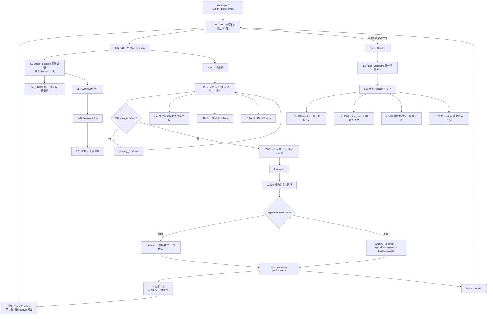
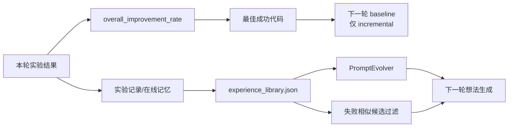
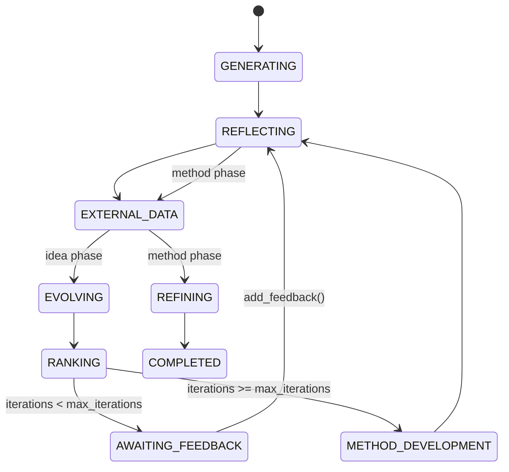
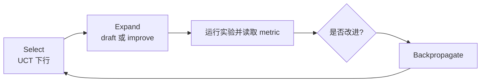
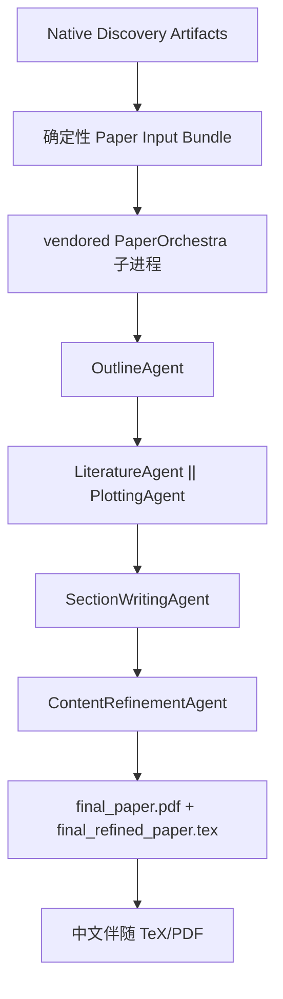

# Vegapunk Loop 机制全景

本文档说明当前 Vegapunk 中真正具有“反馈—再执行”语义的循环、它们的嵌套关系、默认上限、退出条件、产物和恢复边界。文档依据 2026-07-16 的源码与默认配置整理。

## 1. 先给结论

系统不是一个单独的大循环，也不是默认以一棵全局 MCTS 树运行。默认端到端路径是：

1. `Discovery` 外层按轮运行。
2. 每个 Discovery 轮次先按需演化 prompt，再建立一个 MAS 会话；建立会话时默认运行一次 Deep Research（DR）背景调研。
3. MAS 在会话内反复执行“生成 → 批评 → 检索证据 → 演化 → 排名”，到达迭代上限后再进入“方法开发 → 方法批评 → 补证据 → 方法精炼”。
4. 本轮入选想法进入实验阶段。默认实验后端执行“改代码 → 跑实验 → 根据结果继续或修错”；MCTS 是这里的可选替代路径，不是 Discovery 主循环。
5. 实验结果形成两条跨轮反馈边：最佳代码成为下一轮基线，成功/失败经验进入记忆并影响下一轮提示和候选过滤。
6. 所有 Discovery 轮次结束后，只进行一次逻辑上的 Paper Handoff；PaperOrchestra 内部还有论文重试、图表 critic、内容 refinement 和 API retry 等局部循环。

因此，最重要的关系是：

```text
Discovery 轮次
├── DR 背景调研
│   ├── 规划图修复/重建
│   ├── 按依赖层执行
│   └── 节点内工具调用
├── MAS 想法演化
│   ├── 失败想法过滤/再生成
│   ├── 模型工具调用
│   └── 模型请求重试
├── 候选实验（两条路径二选一）
│   ├── 普通 run/修错循环（默认）
│   └── MCTS 搜索（可选）
└── 记忆与基线更新 ───────────────┐
                                     │反馈到下一轮
                                     └───────────

全部 Discovery 轮次完成
└── PaperOrchestra（一次逻辑 Run）
    ├── 整条论文流水线重试
    ├── 每张图的 critic 循环
    ├── 论文内容 refinement 循环
    ├── 一次格式修复检查
    └── 单次模型/图像请求重试
```

## 2. 什么才算一个独立 Loop

本文把重复执行分为四类：

| 类型 | 判断标准 | 例子 |
|---|---|---|
| 反馈循环 | 本轮结果改变下一轮输入或状态 | Discovery 增量基线、MAS 反思演化、论文 refinement |
| 有界重试 | 同一操作失败后再次尝试，不改变上层任务身份 | 模型 API retry、PaperOrchestra 整体 retry |
| 批处理/并发扇出 | 对一组独立对象逐个或并发处理，彼此通常不反馈 | 5 个 top ideas 并发实验、同一层 DR 节点并发执行 |
| 轮询/监控 | 等待外部状态变化，本身不做决策优化 | OpenAI background response polling、实验进度监控 |

只有前两类构成本文的主要 loop 机制。普通的文件遍历、列表格式化、图遍历和并发结果收集不会被误称为独立的科研循环。

## 3. 端到端嵌套关系



编号表示逻辑层级，而不是源码调用深度。一个底层 retry 可能在 DR、MAS、实验或 PaperOrchestra 的任意模型调用中发生。

## 4. Loop 总表

| ID | Loop | 所在位置 | 默认上限 | 主要退出条件 | 反馈给谁 |
|---|---|---|---:|---|---|
| L0 | Discovery 轮次 | `launch_discovery._main()` | 10 轮 | `round_num > loop_rounds` | 下一轮代码基线、提示与记忆 |
| L1 | MAS 想法演化 | `OrchestrationAgent.run_session()` | 4 次排名迭代 | `COMPLETED`、`ERROR`，或暂停在 `AWAITING_FEEDBACK` | 本 Session 的下一阶段 |
| L1a | 失败候选过滤/再生成 | `GenerationAgent` / `EvolutionAgent` | 2 次 | 没有相似失败候选、再生成失败或达到上限 | 当前 MAS 迭代的候选集合 |
| L1b | 原生模型工具调用 | `ModelToolLoop.run()` | 10 个模型回合、20 次工具调用 | 模型不再请求工具或达到任一上限 | 同一次 Agent 调用 |
| L2a | DR 规划图修复 | `GlobalPlannerAgent.execute()` | 每次构图 2 步、每步 2 次请求；整图重建无硬上限 | 模型结束且图无环 | DR 执行图 |
| L2b | DR 图执行 | `Workflow.execute()` | simple/QA 为 5，complex 为 10；属于软上限 | answer 节点可综合，或没有 ready node | DR 最终背景/答案 |
| L2c | DR 节点工具调用 | `ExecutionAgent.execute()` | 每个 subtask 5 次工具调用 | 无工具调用、全部工具失败或达到上限 | 当前 subtask 的总结 |
| L3a | 普通实验 run/修错 | `experiments_utils_claude/iflow.perform_experiments()` | 2 个改进 run；每个失败 run 最多 5 次修错尝试 | 产出有效改进结果、收到 `ALL_COMPLETED` 或耗尽尝试 | 候选实验指标 |
| L3b | MCTS 实验搜索 | `*MCTSSearch.run_mcts_search()` | 30 个 search step；单次 select 最多下行 100 次 | draft 节点终止、root 终止或 step 用尽 | 候选实验指标 |
| L4 | 跨轮记忆闭环 | `MemoryModule` / `ExperienceGenerator` / `PromptEvolver` | 受 L0 轮数约束；默认每轮更新 | Discovery 结束或组件被禁用 | 下一轮生成提示与失败过滤 |
| L5a | Paper 整体 retry | `write_single_paper()` | 3 次 | 产生最终 PDF，或 3 次均失败 | 同一个 PaperOrchestra Run |
| L5b | Figure critic | `process_single_figure()` | 每张图 3 轮 | critic 返回 `No changes needed.`、异常或达到上限 | 当前图的描述与图像 |
| L5c | 论文内容 refinement | `ContentRefinementAgent.run()` | 3 轮 | 分数下降、同分但退化、异常或达到上限 | 当前可接受 TeX/PDF |
| L5d | 论文格式 refinement | `ContentRefinementAgent.run()` | 1 轮 | 无格式问题、编译结果产生或本轮失败 | 最终 TeX/PDF |
| L6 | 请求级 retry/polling | `BaseAgent._call_model()`、Paper helper、`OpenAIModel` | Agent 10 次；Paper 5 次；background timeout 3600 秒 | 成功、重试耗尽或超时 | 发起该请求的局部 loop |

## 5. L0：Discovery 外层轮次

入口位于 `launch_discovery.py::_main()`。默认配置为：

```yaml
workflow:
  loop_rounds: 10
  loop_mode: incremental
```

每轮的固定顺序是：

```text
选择本轮 baseline
  → 可选 PromptEvolver
  → 创建 MAS Session，并在 create_session() 内由 DR 生成背景
  → MAS 生成并精炼 top ideas
  → 对 top ideas 做实验或报告
  → 记录 round_result
  → 更新长期经验库
  → 选择最佳代码供下一轮使用
```

### 5.1 `incremental` 与 `fresh`

- `incremental`：后续轮次使用“截至当前为止表现最好”的成功实验代码作为 baseline。选择依据是结果中的 `performance.overall_improvement_rate`。
- `fresh`：每轮代码都从原始任务目录开始。

一个容易忽略的事实是：`fresh` 只重置代码 baseline，并不自动关闭记忆。默认的 Task Memory、Online Memory、Long Memory 和 PromptEvolver 仍然可以让后续轮次读到前面的经验。因此在默认记忆开关开启时，`fresh` 是“代码起点独立”，不是“信息完全独立”。

### 5.2 两条跨轮反馈边



第一条是代码层反馈，第二条是认知层反馈。`loop_mode` 只控制第一条。

### 5.3 恢复边界

- `--resume` 会扫描已经完成的轮次，从下一轮继续。
- 轮数仍以当前配置为准，所以恢复时可以增加 `loop_rounds`。
- `discovery_summary.json` 是 launch 级汇总；每轮的 MAS Session 另有状态和轨迹。
- Discovery 完成后再次进入同一 launch，会直接进入 Paper Handoff，而不会重跑已完成轮次。

### 5.4 会裁掉内层 Loop 的模式

- `--skip_idea_generation` 会把 `loop_rounds` 强制改成 1，直接读取已有 ideas；这一运行不会进入 PromptEvolver、DR 或 MAS 想法循环。
- `--mode report` 保留外层轮次和 MAS，但用 `ReportWriter` 替代真实实验。因此没有可用于增量代码 baseline 的实验指标，经验生成也可能因为没有 experiment notes 而跳过。
- `agents.dr.enabled: false` 只移除每个 Session 前面的 DR，不影响 MAS 与实验。
- `experiment.use_mcts: true` 用 MCTS 替代普通 run/修错循环，而不是在普通循环外再包一层 MCTS。
- 关闭 Task Memory、Online Memory 或 Long Memory 只切断相应的认知反馈边，不会改变 `loop_rounds`。

## 6. L1：MAS 想法演化状态机

`OrchestrationAgent.run_session()` 不是简单的固定 `for`，而是由 `WorkflowState` 驱动的状态循环。每执行一个阶段都会持久化 Session。



默认 `workflow.max_iterations: 4`，计数在 Ranking 阶段完成后递增。因此一轮 Discovery 中最多进行 4 次“想法批评—证据—演化—排名”，之后才为 top ideas 开发并精炼可执行方法。

### 6.1 `AWAITING_FEEDBACK` 是暂停点，不是计算阶段

`_run_awaiting_feedback_phase()` 本身不做工作；`add_feedback()` 才会把状态切回 `REFLECTING`。

当前 CLI 驱动器 `IdeaGenerator.generate_ideas()` 还有一个值得明确记录的边界：

- 提供 `--offline_feedback` 时，它会在每次 `AWAITING_FEEDBACK` 读取该文件并继续。
- 外部程序也可以调用 `add_feedback()` 后恢复 Session。
- 两者都没有发生时，外层 `while self.status != "completed"` 会反复调用一个仍停在 `AWAITING_FEEDBACK` 的 Session。当前代码没有 sleep、timeout 或自动 fallback，因此这条路径可能形成忙等循环。

也就是说，MAS 状态机本身会正确“暂停”，但当前命令行驾驶循环不会真正阻塞等待。

### 6.2 失败候选过滤/再生成

GenerationAgent 和 EvolutionAgent 都会把候选与历史失败记录比较。相似度超过阈值的候选被丢弃并重新生成：

```text
生成候选
  → 与失败记忆比较
  → 保留新方向
  → 为相似失败方向生成替代候选
  → 再检查
```

默认参数为相似度阈值 `0.7`、最多再生成 `2` 次。达到上限后，剩余候选会被保留，而不是无限再生成。

### 6.3 原生模型工具循环

GenerationAgent 可通过 `BaseAgent._call_model_with_tools()` 进入 `ModelToolLoop`：

```text
模型响应
  ├── 无 tool_calls → 返回最终文本
  └── 有 tool_calls → 执行工具 → 用原 call_id 回传结果 → 继续模型响应
```

默认最多 10 个模型回合、累计 20 次工具调用。任一上限先到即停止。工具异常会被转成模型可见的 `{error: ...}`，而不是直接炸掉整个 MAS Session。

## 7. L2：Deep Research 内部循环

DR 有两个入口：

- QA 模式：`launch_qa.py` 直接调用 DR，最终返回答案，不进入 Discovery、实验或 PaperOrchestra。
- Discovery 模式：每个新 MAS Session 的 `create_session()` 默认先调用一次 DR，生成本轮 background，然后才开始 MAS 想法状态机。

由于默认每个 Discovery 轮次都会创建新 Session，所以默认配置下 DR 不是整个 launch 只运行一次，而是每个 Discovery 轮次运行一次。

### 7.1 规划图生成与修复

`GlobalPlannerAgent.execute()` 包含三层控制：

1. 每次构图最多进行 `global_planner.max_iter` 次增量规划，默认 2。
2. 每次规划请求最多重试 `max_retries` 次，默认 2。
3. 构建 `DirectedGraph` 后如果发现环，则丢弃并重新构图。

第三层当前是 `while True`，没有单独的全局重建次数上限。如果模型持续给出有环图，或者每次请求都无法得到有效 response，这里可能一直重建。这是 DR 中最明显的无硬上限 loop。

### 7.2 依赖图逐层执行

`Workflow.execute()` 每次让 `GlobalExecutionAgent` 执行当前所有 ready nodes，并行完成一层后再检查下一层：

```text
取 ready nodes
  → 并行执行这一层
  → 标记 EXECUTED
  → 可选 Coordinator 修改图
  → answer ready? 是则 Synthesizer
  → 否则进入下一层
```

默认 Discovery 使用 `simple` DR 配置：`main.max_iter: 5`、Coordinator 关闭。`complex` 为 10 且 Coordinator 开启。

这里的 `max_iter` 是软上限：代码在 `cnt > max_execution_layers` 后尝试寻找 answer 节点并强制综合；如果图中找不到 answer 节点，它仍会继续执行，直到没有 ready node。因此它不是无条件的硬停止计数器。

### 7.3 Node → Subtask → Tool

每个 DR 节点通过 `TaskWorkflow` 再拆为若干 subtask。simple/QA 默认最多 2 个，complex 默认最多 3 个；这些 subtask 顺序执行，属于批处理。

每个 subtask 内的 `ExecutionAgent.execute()` 才是真正的小型反馈 loop：

```text
模型决定下一步
  → 调用一个或多个搜索/提取工具
  → 结果沿同一 response chain 返回模型
  → 模型继续调用工具或给出完成答案
```

默认累计最多 5 次工具调用。模型不再请求工具、所有工具均失败或达到上限时退出，然后额外生成 subtask 总结。

## 8. L3：实验循环与可选 MCTS

每轮 MAS 的 top ideas 由 `ExperimentRunner.run_experiments()` 执行。默认 top ideas 数量为 5、最大并发为 4。并发是候选间的扇出，不是一个候选内部的反馈循环。

### 8.1 普通 run/修错循环（默认）

`experiment.use_mcts: false` 时，Claude Code 或 iFlow 走普通路径：

```text
代码 Agent 编辑候选工作区
  → 复制为 run_N
  → 执行 launcher.sh
  ├── 成功 → 读取指标 → 进入下一 run
  └── 失败 → 把 traceback/错误写入下一提示 → 修改后重跑同一 run
```

默认 `experiment.max_runs: 2`，表示在已有 `run_0` baseline 之外尝试 `run_1` 和 `run_2`。每个失败 run 的修错上限由常量 `MAX_ITERS = 5` 控制。

Claude Code 路径最终还会验证是否至少存在一个有效的 `run_N/final_info.json`；仅有模型输出中的“已完成”文字不算成功。

### 8.2 MCTS 路径（可选且互斥）

`experiment.use_mcts: true` 时，Claude/iFlow 普通 run 循环被 MCTS 替代：



- 搜索默认最多 30 个 step。
- 单次 `select()` 为防止树下行卡死，最多迭代 100 次；超过后把当前节点强制标为 terminal。
- 所有 draft 子节点终止、root 终止或 step 用尽时结束。
- MCTS 的最佳节点最终仍然以一个候选实验结果返回，并继续进入外层的性能比较、记忆写入和下一轮 baseline 选择。

所以 MCTS 与 Discovery 的关系是“内层实验策略”，不是“外层科研流程”。目录中的 `launch/session/candidate/run` 层级也只是产物组织方式，不能据此把整个系统解释成一棵 MCTS 树。

## 9. L4：记忆闭环

记忆模块本身没有一个永不停歇的线程；它依附在 Discovery 每轮的边界上，闭合跨轮反馈：

1. 成功实验由 OnlineMemorySaver 写入 Task Memory。
2. 每轮结束后，`ExperienceGenerator` 匹配 idea 与 experiment notes，生成或合并 `experience_library.json`。
3. 下一轮 `PromptEvolver` 根据经验库生成多个候选 prompt，并结合 IdeaGraph 选择探索性更强的版本。
4. GenerationAgent / EvolutionAgent 同时用失败记录过滤相似候选。

默认 `evolution_interval: 1`，含义是从第 2 轮开始，每轮都尝试演化 prompt。演化前会写 `prompt_backup_roundN.json`；演化失败则继续使用旧 prompt。

这条闭环与代码 baseline 闭环相互独立：可以使用 `fresh + memory`，也可以使用 `incremental` 但关闭某些记忆组件。

## 10. L5：PaperOrchestra 内部循环

所有配置的 Discovery 工作结束后，`launch_discovery` 调用 `run_paper_orchestra()`。当前生命周期是：一个 Discovery Launch 对应一个完成的 Paper；完成后重入复用既有 TeX/PDF。内部 retry 不创建新论文版本，也不创建新的逻辑 Paper Run。



### 10.1 整条论文流水线 retry

`write_single_paper()` 最多尝试 3 次。任一步骤抛出异常，都会从 outline、文献、绘图、写作、refinement 这条完整链重新开始。它是进程内 retry，不是持久化 stage resume。

PaperOrchestra 当前没有逐阶段持久 checkpoint。子进程或宿主中断后，不能从 Content Refinement 等内部阶段继续；只有完整成功产物可在重入时直接复用。

### 10.2 每张图的 critic loop

PlottingAgent 会并发处理 outline 中的多张图；每张图内部独立执行：

```text
规划图内容 → 生成图 → critic 看图 → 改描述 → 重新生成图
```

默认由 `config/paper_orchestra.yaml::plotting_max_critic_rounds` 限制为 3 轮。critic 明确返回 `No changes needed.` 或发生异常时提前结束。

### 10.3 论文内容 refinement loop

原始草稿先编译并接受一次 baseline review，随后固定最多 3 轮：

1. 根据当前 reviewer feedback 重写完整 TeX。
2. 编译候选 PDF。
3. 重新 review 并比较 Overall 与各子维度分数。
4. Overall 上升则接受并继续；Overall 下降则回退并停止。
5. Overall 相同且子维度总退化大于总提升时回退并停止，否则接受并继续。

因此它是“只保留不变差版本”的局部 hill-climbing，而不是 MCTS，也不会把论文分支保留成搜索树。

内容 refinement 后还有一个 `max_formatting_loops = 1` 的格式检查/修复步骤。虽然源码称其为 loop，当前实际上最多只做一次格式修复。

### 10.4 请求级 retry

vendored Paper helper 对文本、视觉和图片请求默认最多尝试 5 次，并使用递增等待。请求级 retry、整条论文 retry、内容 refinement 是三种不同层级：

```text
一次内容 refinement
└── 多个模型请求
    └── 每个请求最多 retry 5 次

一次论文 pipeline attempt
└── 最多 3 次内容 refinement

一个逻辑 PaperOrchestra Run
└── 整条 pipeline 最多 retry 3 次
```

## 11. L6：共享的模型请求与轮询

### 11.1 MAS Agent 请求重试

`BaseAgent._call_model()` 默认最多尝试 10 次。失败后固定等待 1 秒再试；尽管 docstring 写有 exponential backoff，当前实现实际是固定 1 秒。耗尽后抛出 `AgentExecutionError`，由上层阶段转入错误处理。

### 11.2 OpenAI background polling

当 Responses API 返回 `queued` 或 `in_progress` 时，`OpenAIModel` 会按默认 2 秒间隔轮询；`asyncio.wait_for` 以默认 3600 秒作为总超时，超时后尝试 cancel。这属于有超时的状态轮询，不是科研优化 loop。

### 11.3 实验进度监控

`ExperimentRunner._start_progress_monitor()` 会持续打印耗时，直到实验的 `stop_event` 被设置。它只提供可观测性，不改变实验决策，因此不属于实验反馈 loop。

## 12. 默认配置下的放大效应

各 loop 的成本是嵌套相乘，而不是简单相加。

默认配置下：

- Discovery：10 轮。
- 每轮入选实验：最多 5 个候选，最多并发 4 个。
- 普通实验：每个候选 2 个改进 run；单个失败 run 最多 5 次修错尝试。
- 每轮 MAS：最多 4 次排名迭代，并在建 Session 时执行一次 simple DR。
- Paper：Discovery 全部结束后 1 个逻辑 Run；内部完整 pipeline 最多重试 3 次。

仅按实验进程粗略估算，极端连续失败情况下就可能达到：

```text
10 Discovery rounds
× 5 selected ideas per round
× 2 improved runs per idea
× 5 attempts per failed run
= 最多约 500 次实验进程执行
```

这不是精确账单：成功会提前推进，`ALL_COMPLETED` 可提前结束，MCTS 会走另一套计数，并发只缩短墙钟时间而不减少总工作量。但它能解释为什么 `loop_rounds`、`top_ideas_count`、`max_runs` 和失败重试数是成本最敏感的四个参数。

## 13. 退出、失败与恢复对照

| Loop | 成功退出 | 失败退出 | 可恢复性 |
|---|---|---|---|
| Discovery | 配置轮次全部完成 | 未捕获异常/进程退出 | 可从已完成轮次继续 |
| MAS 状态机 | `COMPLETED` | `ERROR` | 每阶段持久化，可按 Session 恢复/注入反馈 |
| MAS feedback wait | 收到 feedback | 当前没有自动 timeout | 外部调用 `add_feedback()` 后继续 |
| DR planner | 得到无环执行图 | 局部请求耗尽；整图重建无硬上限 | 无独立持久 checkpoint |
| DR graph | answer 可综合或没有 ready node | 节点失败会进入结果/错误路径 | 无独立跨进程恢复 |
| 普通实验 | 有效 `final_info.json` 等产物 | 尝试耗尽、bad request、timeout | run 产物保留，但没有统一的 run 内 checkpoint 协议 |
| MCTS | 至少一个成功节点 | 没有成功节点或 search step 耗尽 | 树产物可观察，默认不作为 launch resume 边界 |
| PaperOrchestra | 完整英文 TeX/PDF | 整体 retry 耗尽 | 完成产物可复用；内部 stage 不可恢复 |
| 中文伴随稿 | 中文 TeX/PDF 完成 | 记录 warning | 英文 Paper 仍算成功 |

## 14. 当前需要特别留意的无界或软边界

本文不修改代码，但以下事实会影响运行判断：

1. `IdeaGenerator.generate_ideas()` 在缺少 feedback 时可能忙等，因为 `AWAITING_FEEDBACK` 没有 sleep/timeout/fallback。
2. `GlobalPlannerAgent.execute()` 的“发现有环后整图重建”没有全局次数上限。
3. DR 的 `main.max_iter` 只有在能找到 answer 节点时才构成强制综合边界，严格来说是软上限。
4. PaperOrchestra 没有内部 stage checkpoint；完整 pipeline retry 与崩溃后恢复是两件不同的事。

相比之下，Discovery `range(loop_rounds)`、MAS `max_iterations`、候选再生成、工具调用、普通实验修错、MCTS step、Paper critic/refinement 和 provider retry 都有明确计数上限。

## 15. 哪些东西不要误认为独立 Loop

- `launch/session/candidate/run_N` 是产物目录层级，不代表全局搜索树。
- top ideas 的线程池并发是批量执行，不是候选之间互相反馈。
- DR 同一依赖层的 ready nodes 并发执行，不是多个 DR 循环。
- Ranking 的分批打分、文献多源搜索、IdeaGraph 聚类和经验条目遍历是数据处理循环。
- Research Draft 的事件 hook 是观测/记录机制；当前 Paper 基线只消费 Native Discovery Artifacts，不把 Research Draft 作为 Paper 输入，也没有由它驱动额外写作循环。
- PaperOrchestra 的内部 retry 不会创建另一篇 Paper；MCTS 的节点也不会变成新的 Discovery Session。

## 16. 关键源码索引

| 机制 | 入口 |
|---|---|
| Discovery 外层轮次与 Paper Handoff | `launch_discovery.py::_main`、`_run_paper_orchestra` |
| Prompt 演化时机 | `vegapunk/stage.py::IdeaGenerator.load_task` |
| MAS 外部驾驶循环 | `vegapunk/stage.py::IdeaGenerator.generate_ideas` |
| MAS 状态循环 | `vegapunk/mas/workflow/orchestration_agent.py::OrchestrationAgent.run_session` |
| MAS 状态转移 | 同文件的 `_run_*_phase`、`add_feedback` |
| 原生模型工具循环 | `vegapunk/mas/agents/tool_loop.py::ModelToolLoop.run` |
| 候选过滤/再生成 | `generation_agent.py`、`evolution_agent.py` 的 `_filter_and_regenerate_*` |
| DR 总循环 | `vegapunk/mas/agents/dr_agents/workflow/main.py::Workflow.execute` |
| DR 规划图修复 | `global_planner_agent.py::GlobalPlannerAgent.execute` |
| DR 节点工具循环 | `execution_agent.py::ExecutionAgent.execute` |
| 候选实验扇出 | `vegapunk/stage.py::ExperimentRunner.run_experiments` |
| 普通实验修错循环 | `vegapunk/experiments_utils_claude.py::perform_experiments`、iFlow 对应文件 |
| MCTS | `vegapunk/mcts_experiments_utils_{claude,iflow}.py` |
| 跨轮经验更新 | `launch_discovery.py::_generate_experiences_for_round`、`long_memory.py` |
| Paper 宿主边界 | `vegapunk/paper_orchestra/service.py::run_paper_orchestra` |
| Paper 整体 retry | `third_party/paper_orchestra/methods/paper_writer_with_plotting.py::write_single_paper` |
| Figure critic | `third_party/paper_orchestra/methods/agents/plotting_agent.py::process_single_figure` |
| 内容/格式 refinement | `content_refinement_agent.py::ContentRefinementAgent.run` |
| 默认上限 | `config/default_config.yaml`、`config/paper_orchestra.yaml`、`config_qa/simple/complex.yaml` |
