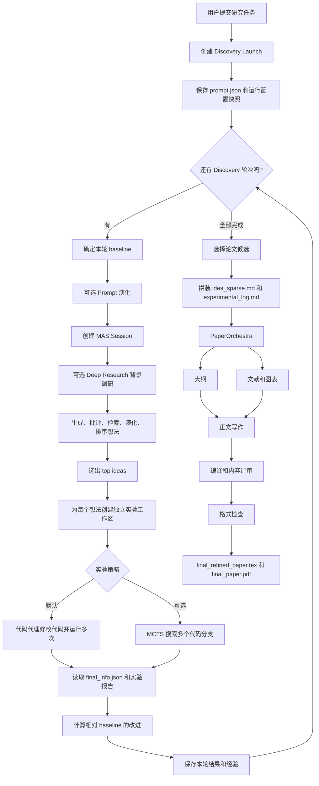

# Vegapunk 从 0 到 1 产出论文的全景说明

这份文档只回答一个问题：给系统一个研究任务后，它是怎样一步步得到一篇论文的。

文档依据当前仓库源码、默认配置和重新建立的代码知识图谱整理。

## 1. 先记住这一句话

Vegapunk 不是一次调用模型直接写论文。

它更像一个小型科研团队：先提出多个研究想法，再把想法变成可执行方法，接着让代码代理真正修改代码并运行实验，最后把研究想法和实验记录交给 PaperOrchestra 写成论文。

最短路径可以写成：

```text
研究任务
  -> 生成多个候选想法
  -> 反思、查资料、演化并排序
  -> 选择若干想法做真实实验
  -> 读取指标，保留更好的代码和证据
  -> 选出一个终稿候选
  -> 组织论文输入材料
  -> 生成大纲、文献、图、正文
  -> 编译、评审、修改和格式检查
  -> final_paper.pdf
```

默认配置下，Discovery 最多做 10 轮，最后每个 launch 只交付一篇逻辑上的论文。

## 2. 先建立一个正确的心智模型

系统里有三种不同的“重复”。

| 重复类型 | 用大白话解释 | 是否改变下一次输入 |
| --- | --- | --- |
| 研究反馈 | 这一轮的结果会影响下一轮从什么代码、什么提示和什么想法开始 | 会 |
| 局部修错 | 同一个操作失败后再试几次 | 通常不会改变上层任务身份 |
| 并发批处理 | 同时验证多个彼此独立的候选想法 | 不会让候选之间即时互相学习 |

因此，系统不是一棵从头到尾都在搜索的 MCTS 树。

MCTS 只是实验阶段的一个可选策略。

默认路径是“多轮 Discovery + 每轮候选实验 + 最后一次论文交接”。

## 3. 一张图看懂全流程



这张图里最重要的两个事实是：

1. 论文写作发生在所有 Discovery 轮次之后。
2. 下一轮的改进来自上一轮的代码结果和经验记录，而不是来自论文草稿。

## 4. 第 0 步：输入是什么，输出目录是什么

### 4.1 输入

一个 Discovery 任务通常至少包含：

- `prompt.json`：研究目标、领域、背景和约束。
- 一个可运行的基线代码目录，或者一个 `sci_task` 任务目录。
- 实验启动方式，例如 `launcher.sh` 或配置中的默认 launcher。
- 当前 launch 使用的模型目录和运行参数。

系统会把任务整理成一个独立的 Launch 目录。

典型路径是：

```text
results/<task_name>/<timestamp>_launch/
```

Launch 一开始会保存自己的 `prompt.json`。

这份副本是本次运行的研究输入，不会随着任务源目录后来被修改而改变。

### 4.2 配置快照

启动时会建立本次运行使用的配置边界。

这保证同一个 launch 内的模型、提示和运行参数不会因为全局设置中途变化而前后不一致。

恢复运行时会继续使用原 Launch 目录，并从已经完成的轮次之后接着走。

## 5. 第 1 步：Discovery 外层轮次

Discovery 是把“研究问题”变成“有实验依据的研究候选”的阶段。

默认配置如下：

```yaml
workflow:
  loop_rounds: 10
  loop_mode: incremental
  max_iterations: 4
  top_ideas_count: 5
```

每一轮做同样的六件事：

```text
确定 baseline
  -> 准备本轮研究提示
  -> 生成并筛选想法
  -> 执行候选实验
  -> 汇总指标和经验
  -> 为下一轮准备更好的起点
```

### 5.1 `incremental` 和 `fresh` 到底差在哪里

`incremental` 是默认模式。

如果本轮有更好的实验结果，系统会把对应的代码和指标前移为下一轮 baseline。

这样下一轮不是重新从原始代码开始，而是在当前最好结果上继续尝试。

`fresh` 模式每轮都从原始任务目录开始。

不过 `fresh` 只重置代码起点，不会自动清除历史记忆。

只要记忆模块开启，后续轮次仍然可能看到之前的想法、失败记录和经验库。

### 5.2 第 1 个反馈边：代码反馈

实验结束后，系统会比较候选最新 run 和候选的 `run_0` baseline。

它从 `final_info.json` 读取指标，并计算每个指标相对 baseline 的变化率。

多个指标会得到一个 `overall_improvement_rate`，用于比较候选结果。

如果下一轮使用 `incremental`，系统会把当前最好结果中的代码、`run_0` 指标，以及科学任务需要的 `outputs/` 和 `report/` 一起更新到新的 baseline。

这一步是“代码继续进化”的原因。

### 5.3 第 2 个反馈边：认知反馈

每轮实验结果还会进入记忆系统。

记忆系统可能包含：

- Task Memory：记录相似任务和实验结果。
- Online Memory：实验完成后自动保存运行信息。
- Long Memory：用 IdeaGraph 保存历史想法之间的关系。
- `experience_library.json`：把想法和实验记录整理成可复用经验。

从第 2 轮开始，PromptEvolver 可以根据经验库修改任务提示。

生成和演化阶段也可以用历史失败记录过滤相似想法。

所以 Discovery 有两条跨轮反馈边：

```text
实验指标 -> 下一轮的代码 baseline
实验经验 -> 下一轮的 prompt、想法生成和失败过滤
```

## 6. 第 2 步：每轮如何产生研究想法

每轮由 `IdeaGenerator` 创建一个新的 MAS Session。

这个 Session 是一次完整的“想法提出和方法打磨”过程。

### 6.1 Session 创建时先做背景调研

默认 `agents.dr.enabled: true`，模式是 `simple`。

因此每一个 Discovery 轮次创建 Session 时，都会先调用一次 Deep Research，给当前研究任务生成背景材料。

默认 simple DR 的主要边界是：

- 执行图最多尝试 5 层。
- Planner 每次最多规划 2 次。
- 最多规划 5 个节点。
- 每个节点最多拆成 2 个子任务。
- 每个子任务最多调用工具 5 次。

Deep Research 的作用是补齐上下文和外部资料。

它不是最终论文写作，也不会直接替代实验。

如果关闭 DR，MAS 仍然可以使用原始任务描述继续工作。

### 6.2 MAS 的想法流水线

MAS 不是简单地让一个模型输出 5 个点子。

它由多个阶段组成：

```text
生成候选想法
  -> 反思优缺点
  -> 查询外部数据或文献
  -> 演化想法和方法
  -> 按 novelty、plausibility、testability、alignment 排序
  -> 是否达到本轮迭代上限
       否 -> 继续反思和演化
       是 -> 方法开发和最终精炼
```

默认 `max_iterations: 4`，表示最多进行 4 次主要的想法迭代。

默认保留 `top_ideas_count: 5` 个候选交给实验阶段。

生成阶段还可以检查候选是否与历史失败想法过于相似。

默认相似度阈值是 `0.7`，每个被过滤方向最多重新生成 2 次。

### 6.3 MAS 的状态和人工反馈

Session 由状态机驱动，主要状态是：

```text
INITIAL
  -> GENERATING
  -> REFLECTING
  -> EXTERNAL_DATA
  -> EVOLVING
  -> RANKING
  -> METHOD_DEVELOPMENT
  -> REFINING
  -> COMPLETED
```

在某些配置下，Ranking 后会进入 `AWAITING_FEEDBACK`。

这个状态本身不是计算阶段，而是等待外部反馈的暂停点。

提供 `--offline_feedback` 或通过接口调用 `add_feedback()` 后，Session 才会回到反思阶段继续。

当前外层命令行驾驶器在没有反馈文件时可能重复推进一个仍处于 `AWAITING_FEEDBACK` 的 Session。

因此，如果要使用需要人工反馈的路径，必须明确提供反馈来源。

### 6.4 模型工具调用不是另一层科研循环

MAS 中的模型有时会请求搜索、检索或其他工具。

其基本动作是：

```text
模型回答
  -> 请求工具
  -> 执行工具
  -> 把工具结果回传给同一个模型请求链
  -> 模型继续回答或结束
```

默认工具循环最多 10 个模型回合和 20 次工具调用。

它只是一次 Agent 操作内部的工具交互，不是一次新的 Discovery 轮次。

## 7. 第 3 步：把想法变成真实实验

MAS 只负责提出和打磨候选方法。

真正决定“这个想法有没有用”的是实验阶段。

`ExperimentRunner` 会为每个 top idea 建立独立工作区。

这样一个候选修改代码时，不会污染其他候选。

典型候选目录大致如下：

```text
session_<id>/<timestamp>_<idea_name>/
├── notes.txt
├── run_0/
├── run_1/
├── run_2/
├── experiment_report.txt 或 log.txt
└── 其他代码、输出和报告
```

### 7.1 `run_0` 是什么

`run_0` 是候选实验开始前的 baseline 备份。

它保存基线代码和基线 `final_info.json`，用于后续比较改进幅度。

没有有效的 `run_N/final_info.json`，系统不会把“模型说已经完成”当成成功实验。

### 7.2 默认实验路径：代码代理修错和改进

默认 `experiment.use_mcts: false`。

普通实验的过程是：

```text
把研究方法写成给代码代理的任务
  -> 代码代理修改工作区
  -> 执行 launcher.sh
  -> 读取返回码、错误信息和指标
  -> 成功则进入下一次 run
  -> 失败则把错误写入下一次提示并修错重跑
```

默认 `experiment.max_runs: 2`。

这表示在 `run_0` 之外最多尝试 `run_1` 和 `run_2`。

单个 run 失败时，代码代理最多修错 5 次。

成功并不只看模型输出文字。

系统还会检查有效的实验产物是否真的落盘。

### 7.3 可选实验路径：MCTS

如果设置 `experiment.use_mcts: true`，普通 run 和修错路径会被 MCTS 替代。

MCTS 会在代码候选节点之间执行：

```text
选择一个值得继续的节点
  -> 扩展 draft 或 improve 分支
  -> 运行实验并读取指标
  -> 判断是否改进
  -> 回传分数
  -> 再选择下一个节点
```

默认搜索最多 30 个 step。

每个 draft 或 improve 分支内部仍然最多修错 5 次。

MCTS 的最佳节点最终仍然要回到 Discovery 的结果汇总、记忆写入和下一轮 baseline 选择。

因此 MCTS 是“候选内部的实验策略”，不是整个系统的总架构。

### 7.4 多个候选为什么可以并发

默认每轮最多保留 5 个候选，实验并发上限默认是 4。

并发只表示多个独立候选同时跑。

候选之间不会在运行中互相修改或即时传递反馈。

所有候选完成后，系统才统一比较它们的结果。

## 8. 第 4 步：一轮结束后系统保存什么

每轮结束时会保存：

- `ideas.json`：本轮用于实验的候选方法。
- `traj.json`：Session 轨迹。
- 候选目录：代码、run、指标、错误和实验报告。
- `discovery_summary.json`：整个 launch 的轮次汇总。
- 记忆条目和经验库：供后续轮次使用。

本轮结果会被归档成类似下面的结构：

```json
{
  "round": 1,
  "session_id": "session_...",
  "results": [
    {
      "idea_name": "...",
      "success": true,
      "code_path": "...",
      "performance": {
        "overall_improvement_rate": 12.3
      }
    }
  ],
  "successful": 1,
  "failed": 0
}
```

当所有 Discovery 轮次完成后，系统才进入论文阶段。

## 9. 第 5 步：为什么论文阶段不是简单读取“最佳代码”

论文需要的是研究叙事和证据，而不只是一个代码目录。

因此 PaperOrchestra 会先把 Discovery 产物整理成一个稳定的输入包。

### 9.1 先选择论文候选

PaperOrchestra 会优先从成功实验候选中寻找终稿候选。

候选选择会记录：

- 哪一轮是论文候选轮。
- 哪些候选成功。
- 使用了什么指标或选择准则。
- 是否发生平局或 fallback。
- 最终选择了哪个候选目录。

如果多个候选都无法通过明确的指标准则，系统会使用受记录的 fallback 选择。

这一步的结果写入 `candidate_selection.json`。

### 9.2 再生成两个论文原材料文件

PaperOrchestra 不直接读取整棵 Discovery 目录。

适配层会在 `paper_orchestra_runs/paper/raw_materials/` 下生成两个主要文件。

`idea_sparse.md` 包含：

- Launch 的原始研究提示。
- 选中候选的 `notes.txt`，如果存在。

`experimental_log.md` 包含：

- 选中候选的实验叙述。
- 每个 run 的 `final_info.json`。
- 运行报告。
- 错误日志或 traceback，如果存在。

这一步是从“可运行的工程产物”到“论文可读证据”的转换。

## 10. 第 6 步：PaperOrchestra 怎样写出论文

当前默认 `config/paper_orchestra.yaml` 开启 plotting。

PaperOrchestra 的主流水线是：

```text
idea_sparse.md + experimental_log.md + LaTeX 模板
  -> OutlineAgent 生成论文大纲
  -> LiteratureAgent 补充相关工作和引用
  -> PlottingAgent 规划并生成图表
  -> SectionWritingAgent 写出完整 TeX 初稿
  -> ContentRefinementAgent 编译、评审和修改
  -> 格式检查和必要修复
  -> final_refined_paper.tex + final_paper.pdf
```

### 10.1 大纲

OutlineAgent 读取研究想法、实验记录、模板和会议规范。

它先把实验材料组织成论文的论证结构。

常见结构包括问题、方法、实验、结果、局限和结论。

### 10.2 文献和图表

大纲产生后，文献检索和图表生成可以并行执行。

LiteratureAgent 负责相关工作、引用和引用映射。

PlottingAgent 根据大纲和实验材料规划图表。

每张图大致经过：

```text
读取实验材料
  -> 规划图的目的和内容
  -> 生成图描述
  -> 生成图像
  -> critic 检查
  -> 必要时改描述并重新生成
```

默认每张图最多进行 3 轮 critic。

critic 返回 `No changes needed.` 时会提前结束。

### 10.3 正文写作

SectionWritingAgent 把大纲、引用、图表信息、想法和实验记录写成完整 LaTeX 初稿。

这一步的产物是 `raw_draft_paper.tex`。

### 10.4 内容评审和修改

ContentRefinementAgent 先编译初稿，再进行一次基线评审。

之后最多进行 3 轮内容 refinement：

```text
当前 TeX
  -> 编译 PDF
  -> 评审论文质量
  -> 根据反馈重写
  -> 再编译和评审
  -> 只接受没有变差的版本
```

它比较 Overall 和多个子维度分数。

如果新版本变差，通常会停止并保留上一个可接受版本。

### 10.5 格式检查

内容 refinement 后还有一次独立的格式检查。

它会把 PDF 页面转成截图，检查图表、边距、布局和模板规范。

当前格式修复最多进行 1 轮。

格式修复只允许改变布局、间距和排版，不应改变论文的科学内容。

### 10.6 论文级重试和复用

PaperOrchestra 的 vendored writer 如果整条写作流程抛出异常，最多从大纲阶段重新尝试 3 次。

这是整条 pipeline 的重试，不是从某个中间 stage 恢复。

当前 PaperOrchestra 没有把 Outline、Literature 或 Content Refinement 做成独立的跨进程 checkpoint。

一旦完整的 TeX 和 PDF 已经生成，后续重新打开同一个 launch 会复用已完成的论文结果。

中文伴随稿在英文论文完成后单独生成。

中文伴随稿失败会记录 warning，但不会把已经成功的英文论文标记为失败。

## 11. 最终交付物在哪里

一个完整 Launch 的关键目录通常是：

```text
results/<task_name>/<launch_id>/
├── prompt.json
├── discovery_summary.json
├── session_<id>/
│   ├── ideas.json
│   ├── traj.json
│   ├── ideas_visualization.pdf
│   └── <candidate>/
│       ├── notes.txt
│       ├── run_0/
│       ├── run_1/
│       ├── run_2/
│       └── experiment_report.txt 或 log.txt
└── paper_orchestra_runs/
    └── paper/
        ├── candidate_selection.json
        ├── raw_materials/
        │   ├── idea_sparse.md
        │   └── experimental_log.md
        ├── outline.json
        ├── literature_agent_output/
        ├── plotting_results.json
        ├── latex_writeup/
        ├── content_refinement_workdir/
        ├── final_refined_paper.tex
        ├── final_paper.pdf
        └── 中文伴随稿相关文件
```

最重要的两个最终文件是：

- `paper_orchestra_runs/paper/final_refined_paper.tex`
- `paper_orchestra_runs/paper/final_paper.pdf`

## 12. 默认配置下，系统到底会做多少工作

下面是默认值，不是所有任务都一定会跑到上限。

| 层级 | 默认上限或设置 | 作用 |
| --- | --- | --- |
| Discovery | 10 轮 | 让代码和想法跨轮进化 |
| MAS | 4 次主要迭代 | 让候选想法经过反思、检索、演化和排序 |
| 每轮候选 | 5 个 top ideas | 决定进入实验的候选数量 |
| 候选并发 | 最多 4 个 | 同时运行独立实验 |
| 普通实验 | `run_0` 加最多 2 个改进 run | 验证和改进一个候选 |
| 单个失败 run | 最多修错 5 次 | 防止同一错误无限重试 |
| MCTS | 最多 30 个搜索 step | 可选的候选内部搜索 |
| DR simple | 最多 5 层执行 | 给每轮 Session 补背景 |
| 每个 DR 子任务 | 最多 5 次工具调用 | 搜索和提取证据 |
| PaperOrchestra 整体 | 最多 3 次完整重试 | 处理写作流程级异常 |
| 每张图 critic | 最多 3 轮 | 迭代图表质量 |
| 内容 refinement | 最多 3 轮 | 改进论文内容 |
| 格式 refinement | 最多 1 轮 | 修复版式问题 |

这些上限是嵌套的。

例如，10 轮 Discovery 中每轮 5 个候选，理论上会产生大量实验进程。

实际运行通常会因为成功、失败、`ALL_COMPLETED`、没有可用候选或资源限制而提前结束。

## 13. 失败、恢复和几个容易误解的地方

### 13.1 Discovery 可以从已完成轮次恢复

`--resume` 会扫描 Launch 目录中已经完成的轮次。

恢复后从下一轮继续，并且仍然以当前配置决定总轮数。

因此可以在恢复时把总轮数延长。

如果 Discovery 轮次已经全部完成，恢复命令会直接进入 Paper Handoff。

### 13.2 论文阶段不是“再跑一遍 Discovery”

论文阶段不会重新生成一批想法，也不会重新跑实验。

它只消费已经落盘的 Discovery 产物。

它的任务是选择候选、整理证据、补文献、生成图表和写作。

### 13.3 `launch/session/candidate/run_N` 不是一棵全局搜索树

这些目录名表示不同的产物层级：

- `launch` 是一次完整研究运行。
- `session` 是一轮 MAS 想法会话。
- `candidate` 是一个待验证研究想法。
- `run_N` 是这个候选的一次代码实验运行。

MCTS 只有在显式开启时，才会在候选内部建立搜索节点。

### 13.4 `--mode report` 不是完整科学实验

`--mode report` 会把实验阶段替换成报告生成。

这样可以整理想法，但不会产生真实实验指标。

后续 PaperOrchestra 仍可能被调用，但论文中的实验证据会比真实 experiment mode 少。

### 13.5 没有成功候选时，论文输入会变弱

PaperOrchestra 可以在没有明确选中候选时回退到 Launch Prompt。

但是这时 `experimental_log.md` 可能只有很少内容，论文可能缺少可验证的实验证据。

“PaperOrchestra 被调用”不等于“论文已经有足够科学证据”。

### 13.6 Research Draft 不是当前论文的主输入

Research Draft 主要记录可观测的研究事件。

当前 PaperOrchestra 的原始输入是 Native Discovery Artifacts，也就是 Launch Prompt、候选记录、实验报告和 run 产物。

不要把 Research Draft 误认为另一条会自动驱动论文写作的主循环。

## 14. 用一个具体例子理解一轮

假设用户要研究“改进某个模型在任务 X 上的表现”。

系统可能这样工作：

1. 读取 `prompt.json`，知道目标指标、领域和约束。
2. Deep Research 搜索相关方法，返回背景材料。
3. MAS 提出 15 个初始方向，反思和演化后保留 5 个方法。
4. 每个方法获得一个独立工作区，并把当前代码保存为 `run_0`。
5. 代码代理实现方法并运行实验。
6. 某个候选第一次运行报错，系统把 traceback 交回代码代理修错。
7. 成功运行产生 `run_1/final_info.json`，系统计算相对 `run_0` 的改进。
8. 本轮结束后，把候选、指标和错误写入 session 和经验库。
9. 下一轮 PromptEvolver 看到“某方向有效、某方向失败”，生成更有针对性的研究提示。
10. 10 轮结束后，从成功候选中选出一个终稿候选。
11. 适配层把它整理成 `idea_sparse.md` 和 `experimental_log.md`。
12. PaperOrchestra 生成大纲、文献、图表、正文，并编译成 PDF。
13. 内容评审和格式检查保留可接受版本，最终输出 `final_paper.pdf`。

这就是系统从 0 到 1 的完整闭环：

```text
问题 -> 想法 -> 方法 -> 代码 -> 实验 -> 指标 -> 证据 -> 论文
```

## 15. 关键源码索引

| 责任 | 入口 |
| --- | --- |
| Discovery 启动、外层轮次和 Paper Handoff | `launch_discovery.py::_main` |
| 本轮 Prompt 读取和演化 | `vegapunk/stage.py::IdeaGenerator.load_task` |
| MAS 外部驾驶循环 | `vegapunk/stage.py::IdeaGenerator.generate_ideas` |
| MAS 状态机 | `vegapunk/mas/workflow/orchestration_agent.py::OrchestrationAgent.run_session` |
| MAS 阶段切换和反馈 | `vegapunk/mas/workflow/orchestration_agent.py` 中的 `_run_*_phase` 与 `add_feedback` |
| 模型工具循环 | `vegapunk/mas/agents/tool_loop.py::ModelToolLoop.run` |
| 候选实验扇出 | `vegapunk/stage.py::ExperimentRunner.run_experiments` |
| 单候选工作区和指标计算 | `vegapunk/stage.py::ExperimentRunner._run_single_experiment` 与 `_calculate_experiment_performance` |
| 普通代码实验循环 | `vegapunk/experiments_utils_codex.py::perform_experiments` |
| MCTS 实验循环 | `vegapunk/mcts_experiments_utils_codex.py::CodexMCTSSearch.run_mcts_search` |
| 跨轮经验生成 | `launch_discovery.py::_generate_experiences_for_round` |
| 增量 baseline 更新 | `launch_discovery.py::_update_baseline_for_incremental` |
| 论文适配和单 Paper Run | `vegapunk/paper_orchestra/service.py::run_paper_orchestra` |
| 终稿候选选择 | `vegapunk/paper_orchestra/candidate_selection.py::select_candidate` |
| 论文流水线 | `third_party/paper_orchestra/methods/paper_writer_with_plotting.py::write_single_paper` |
| 单图生成和 critic | `third_party/paper_orchestra/methods/agents/plotting_agent.py::process_single_figure` |
| 内容和格式 refinement | `third_party/paper_orchestra/methods/agents/content_refinement_agent.py::ContentRefinementAgent.run` |
| Discovery 默认参数 | `config/default_config.yaml` |
| PaperOrchestra 默认参数 | `config/paper_orchestra.yaml` |
| Deep Research simple 参数 | `vegapunk/mas/agents/dr_agents/config_simple.yaml` |

## 16. 最后再压缩成四句话

第一，MAS 负责提出和打磨“可能值得做什么”。

第二，实验后端负责验证“这个方法实际有没有用”。

第三，记忆和增量 baseline 负责让下一轮站在上一轮结果上继续探索。

第四，PaperOrchestra 负责把已经产生的想法、实验和证据组织成一篇可编译、可评审、可交付的论文。
