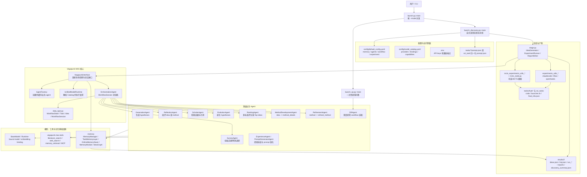
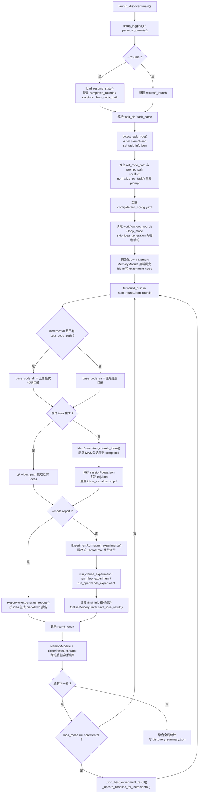
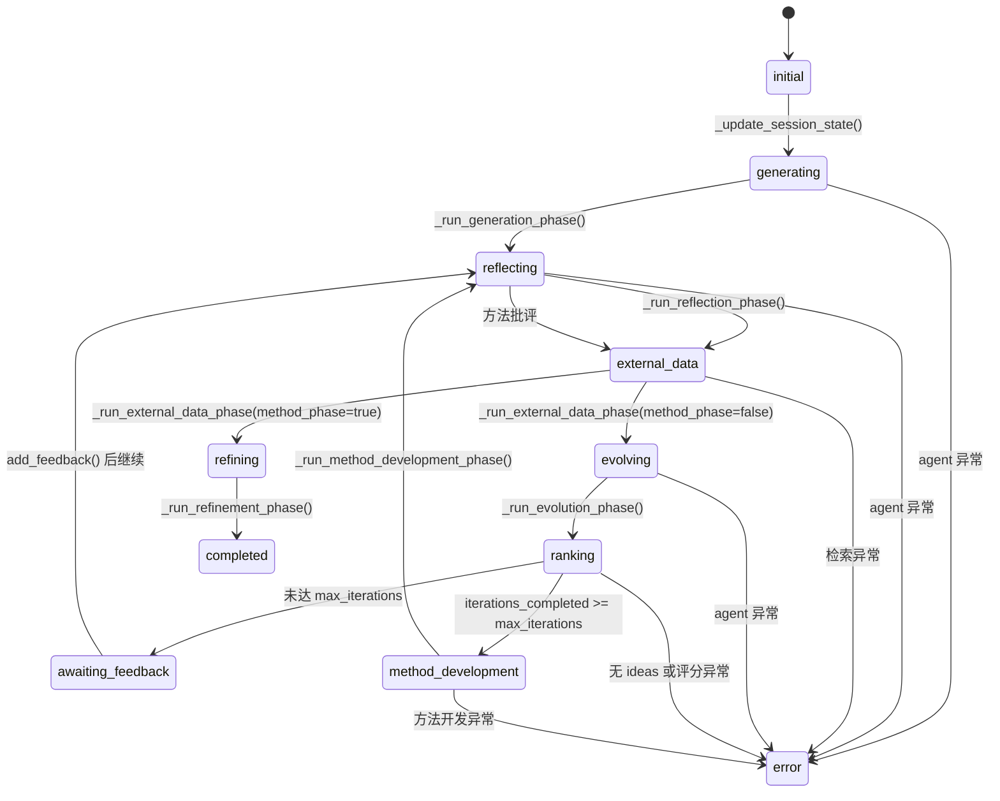
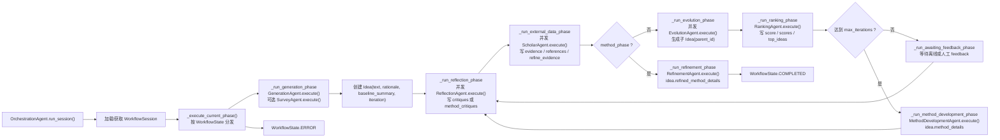
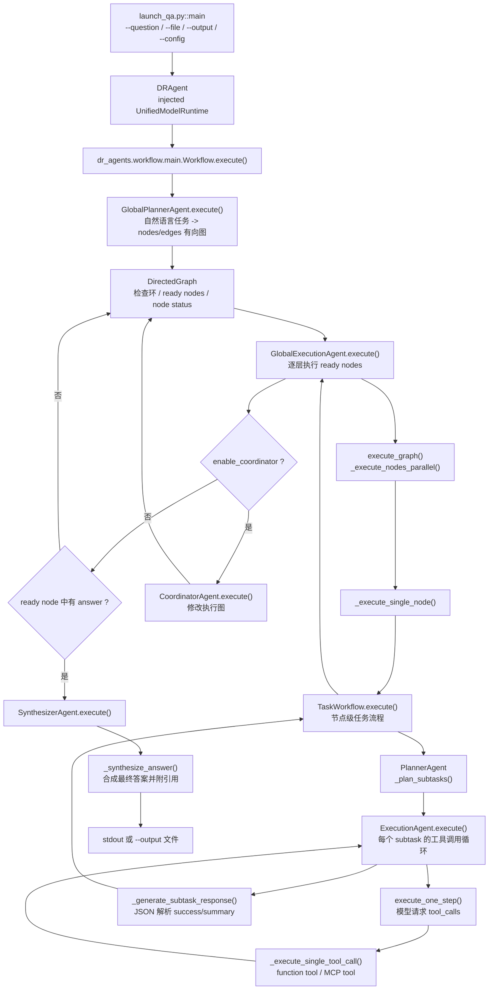
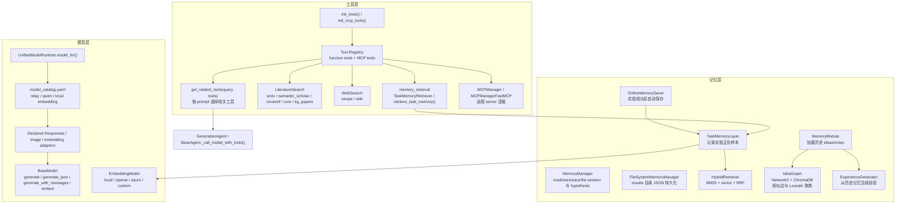
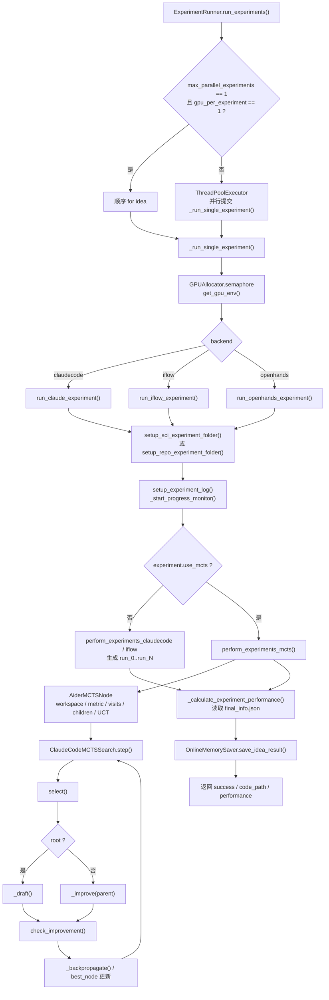
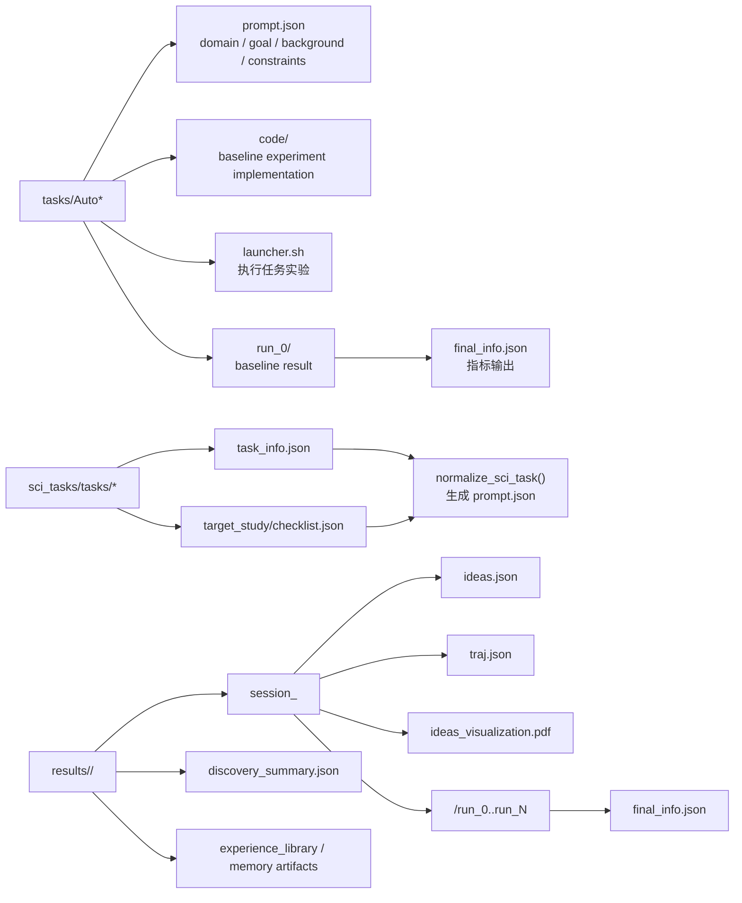

# Vegapunk 项目流程架构

本文档基于当前代码图谱和源码实现整理，重点覆盖启动入口、发现实验主循环、多智能体编排、深度研究 QA、模型/工具/记忆、实验执行、MCTS 和任务目录结构。

## 总览架构图

## 发现实验主流程

## MAS 会话状态机

## OrchestrationAgent 阶段实现图

## 顶层 Agent 模块实现

```mermaid
flowchart TB
    Factory["AgentFactory._agent_registry"] --> Gen["generation -> GenerationAgent"]
    Factory --> Ref["reflection -> ReflectionAgent"]
    Factory --> Evo["evolution -> EvolutionAgent"]
    Factory --> Meth["method_development -> MethodDevelopmentAgent"]
    Factory --> Refin["refinement -> RefinementAgent"]
    Factory --> Rank["ranking -> RankingAgent"]
    Factory --> Surv["survey -> SurveyAgent"]
    Factory --> Schol["scholar -> ScholarAgent"]
    Factory --> DR["dr -> DRAgent"]
    Factory --> Exp["experience -> ExperienceAgent"]
    Factory --> PE["prompt_evolver -> PromptGeneratorAgent"]

    Gen --> G1["构造 hypotheses JSON schema"]
    Gen --> G2["get_related_tools() + _call_model_with_tools()"]
    Gen --> G3["TaskMemoryRetriever guidance<br/>过滤失败相似 idea"]
    Gen --> G4["_call_model(schema)<br/>返回 hypotheses / reasoning / baseline_summary"]

    Ref --> R1["根据 method_details 选择 hypothesis 或 method critique schema"]
    Ref --> R2["_build_reflection_prompt()"]
    Ref --> R3["返回 critiques / strengths / suggestions"]

    Surv --> S1["web_search_query()"]
    Surv --> S2["advanced_query_paper()<br/>arxiv / crossref / web_search"]

    Schol --> C1["_generate_search_queries()"]
    Schol --> C2["_gather_literature_evidence()"]
    Schol --> C3["_generate_relevance_summary()"]

    Evo --> E1["构造 evolved_hypotheses schema"]
    Evo --> E2["_build_evolution_prompt()"]
    Evo --> E3["TaskMemoryRetriever 过滤失败相似 evolved idea"]

    Rank --> K1["按 SCORE_BATCH_SIZE=5 分批评分"]
    Rank --> K2["criteria: novelty / plausibility / testability / alignment"]
    Rank --> K3["strategy=distinct 时按 parent_id 去重后取 Top N"]

    Meth --> M1["method_details schema<br/>name/title/description/statement/method"]
    Meth --> M2["_build_method_development_prompt()"]

    Refin --> F1["refined_method schema"]
    Refin --> F2["失败时回退原 method_details"]

    DR --> D1["加载 DR workflow config"]
    DR --> D2["workflow.execute(task, file_path)"]

    Exp --> X1["对比实验结果"]
    Exp --> X2["更新 experience_library"]
    PE --> P1["从高置信经验生成新 task/background prompt"]
```

## 深度研究 QA 子系统

## 模型、工具、记忆基础设施

## 实验执行与 MCTS

## 任务目录与产物结构

## 模块实现清单

| 模块 | 关键文件/类/函数 | 实现职责 |
|---|---|---|
| 统一入口 | `launch.py::main` | 解析 `--mode`，把参数转交 `launch_qa.py` 或 `launch_discovery.py`。 |
| QA 入口 | `launch_qa.py::main` | 构造 `DRAgent`，执行 `agent.execute({'task', 'file_path'})`，打印或写出答案。 |
| 发现入口 | `launch_discovery.py::main` | 处理 resume、任务识别、配置、长记忆、多轮 discovery、实验/报告、incremental baseline、最终 summary。 |
| Idea 生成阶段 | `stage.py::IdeaGenerator.generate_ideas` | 启动 `VegapunkInterface` 会话，循环驱动状态机，处理 feedback，获取 top ideas，保存轨迹和可视化。 |
| MAS 接口 | `VegapunkInterface` | 加载配置、初始化模型工厂/记忆/agent/编排器、启动本地和 MCP 工具、提供 session API。 |
| 会话状态机 | `OrchestrationAgent` | 将 `WorkflowSession.state` 分发到生成、反思、证据、进化、排名、方法开发、精炼等阶段。 |
| 数据结构 | `WorkflowState`, `Task`, `Idea`, `WorkflowSession` | 保存任务、idea、证据、批评、分数、方法详情、top ideas、会话状态和迭代信息。 |
| Agent 工厂 | `AgentFactory` | 注册 11 类业务 agent，使用注入的 `UnifiedModelRuntime` 创建并缓存实例。 |
| Agent 基类 | `BaseAgent` | 统一模型调用、JSON schema 输出、重试、工具调用循环和工具执行。 |
| 生成 Agent | `GenerationAgent.execute` | 生成 hypotheses；使用工具上下文、历史记忆 guidance，并过滤失败相似方案。 |
| 反思 Agent | `ReflectionAgent.execute` | 对 hypothesis 或 method 生成结构化 critiques、strengths、suggestions。 |
| Survey Agent | `SurveyAgent.execute` | 在 idea 生成前做文献和网页调研，为生成阶段提供 `paper_lst`/`web_results`。 |
| Scholar Agent | `ScholarAgent.execute` | 为每个 idea 生成检索 query，收集 evidence/references，并生成 relevance summary。 |
| 进化 Agent | `EvolutionAgent.execute` | 基于 critiques/evidence/feedback 生成 `evolved_hypotheses`，可结合记忆过滤。 |
| 排名 Agent | `RankingAgent.execute` | 按 configured criteria 分批评分，排序并输出 `top_hypotheses`。 |
| 方法开发 Agent | `MethodDevelopmentAgent.execute` | 将 top idea 转成结构化 `method_details`。 |
| 精炼 Agent | `RefinementAgent.execute` | 用 method critiques 和 literature 生成 `refined_method`，失败时回退原方法。 |
| DR Agent | `DRAgent.execute` | 将 QA/背景研究任务转发给 DR workflow，失败时返回兜底背景说明。 |
| DR 全局 workflow | `dr_agents/workflow/main.py::Workflow.execute` | 全局规划、分层执行、可选协调、遇到 answer 节点后合成最终答案。 |
| DR 规划器 | `GlobalPlannerAgent.execute` | 通过 LLM 多轮生成 DAG，检查环并构造 `DirectedGraph`。 |
| DR 执行器 | `GlobalExecutionAgent.execute_graph` | 获取 ready nodes，并行执行一层节点，更新节点状态与结果。 |
| DR 节点 workflow | `TaskWorkflow.execute` | 规划节点内 subtasks，逐个执行并汇总节点结果。 |
| DR 工具执行 | `ExecutionAgent.execute` | 子任务级工具调用循环，维护 messages，解析最终 JSON summary。 |
| DR 合成器 | `SynthesizerAgent.execute` | 从执行图、answer 节点和引用管理器合成最终答案。 |
| 模型层 | `UnifiedModelRuntime`, `BaseModel`, `OpenAIModel` | 通过 Catalog 统一 text/json/messages/vision/image/embedding 接口。 |
| 工具层 | `literature_search.py`, `web_search.py`, `memory_retrieval.py`, `mcp_manager*.py` | 提供学术检索、网页检索、任务记忆检索和远程 MCP 工具接入。 |
| 上下文记忆 | `MemoryManager`, `FileSystemMemoryManager` | 持久化 session 与 hypothesis JSON。 |
| 任务记忆 | `TaskMemoryLayer`, `HybridRetriever` | 保存实验结果，计算正/负标签，BM25+向量检索相似记录，生成 guidance prompt。 |
| 在线记忆 | `OnlineMemorySaver` | 实验成功后自动把 idea 和 run 结果写入任务记忆。 |
| 长记忆 | `MemoryModule`, `IdeaGraph`, `ExperienceGenerator` | 加载历史 ideas/notes，构建相似图、聚类并生成经验。 |
| 实验执行 | `ExperimentRunner` | 为每个 idea 创建实验目录，分配 GPU，调用后端，计算性能，写 online memory。 |
| 报告生成 | `ReportWriter` | 基于 idea 生成 markdown 报告，报告模式不跑实验。 |
| MCTS 实验 | `ClaudeCodeMCTSSearch`, `IFlowMCTSSearch`, `AiderMCTSNode` | 可选搜索代码方案树，用 UCT 选择、draft/improve、指标回传和 best node 更新。 |
| 可视化 | `vis_tree.py`, `visualize_mcts*.py` | 将 MAS 轨迹或 MCTS 日志转成 PDF/HTML/Graphviz/ASCII 可视化。 |

## 关键运行路径

1. 发现实验：`launch.py --mode discovery` -> `launch_discovery.main()` -> `IdeaGenerator.generate_ideas()` -> `VegapunkInterface` -> `OrchestrationAgent` -> top ideas -> `ExperimentRunner.run_experiments()` -> `tasks/*/code` -> `final_info.json` -> `OnlineMemorySaver` -> `discovery_summary.json`。
2. QA：`launch.py --mode qa` 或 `launch_qa.py` -> `DRAgent.execute()` -> `Workflow.execute()` -> `GlobalPlannerAgent` -> `GlobalExecutionAgent` -> `TaskWorkflow`/`ExecutionAgent` -> `SynthesizerAgent` -> answer。
3. 增量多轮：每轮实验结束后，`_find_best_experiment_result()` 选择最优代码路径；下一轮在 `loop_mode=incremental` 时用该路径作为 baseline。
4. 记忆闭环：实验结果进入 `TaskMemoryLayer`；下一轮 `GenerationAgent` 和 `EvolutionAgent` 通过 memory guidance/failed-similarity filtering 避开失败方向并复用成功模式。
