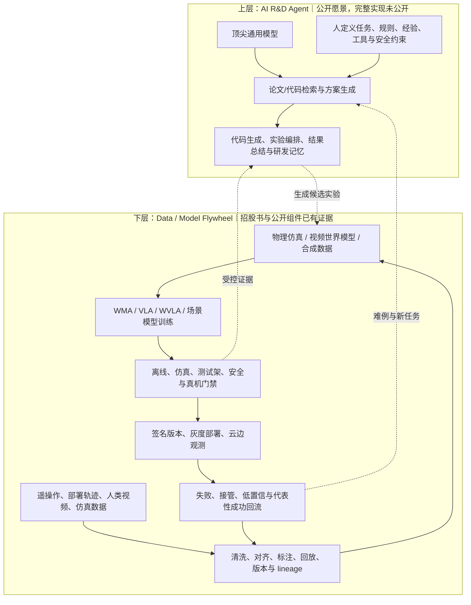
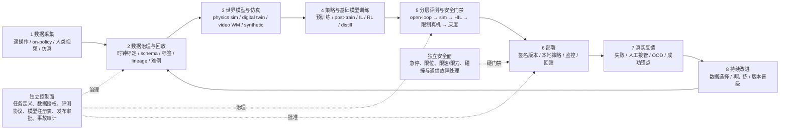

# 宇树“物理 AI 机器人自进化”路线溯源与行业技术地图

调研日期：2026-08-20  
面向对象：具身智能技术与平台决策者  
证据口径：优先采用监管披露、公司官方技术页面/仓库、论文、项目官网和官方模型卡。知乎/媒体只用于图像溯源，不作为模型能力或工程成熟度的技术事实来源。

## 执行摘要

1. **知乎中的六步圆环图不是已经找到出处的宇树官方架构图。** 原文同时放了午宴现场投屏照片和一张单独制作的 1080×810 红底圆环图；后者无图注、无官方链接，六步文字与极客公园正文的归纳完全对应。能确认的现场投屏只有“物理 AI 机器人自进化 V1.0”以及四条规模化判断，因此六步图应标为“媒体根据讲话重构”，不能标成宇树正式产品架构或已交付模块。[极客公园知乎转载，2026-08-19](https://zhuanlan.zhihu.com/p/2073454334373896403)

2. **宇树最权威、也更详细的公开路线在招股书，不在这张图。** 上交所披露文件明确把通用人形机器人具身大模型定义为“数据—训练—评估—再数据”的正向闭环，并披露 WMA、VLA 并行推进，随后向 WVLA 融合、工业与家居垂直模型、真实世界数据集、开发训练平台、感知采集和实时控制仿真平台延伸。[《宇树科技股份有限公司招股说明书》，PDF p.157-158、p.374-375，2026-08-14](https://static.sse.com.cn/disclosure/listedinfo/announcement/c/new/2026-08-14/688836_20260814_AJKD.pdf)

3. **路线已经有相当多公开组件，但统一“自进化操作系统”仍未公开。** 宇树已经公开遥操作与数据采集、LeRobot 数据转换/编辑/训练、Isaac Lab 与 MuJoCo 仿真、WMA/VLA 训练推理、真机客户端和 SDK；官方具身智能平台也定位于数据采集、训练、仿真评估、真机部署与云边协同。[Unitree GitHub](https://github.com/unitreerobotics)；[宇树具身智能平台](https://eai.unitree.com/)。但没有公开自动论文检索与代码生成代理、统一实验编排器、失败自动归因、安全晋级、灰度发布、回滚和经授权的客户机群数据回流协议。

4. **现阶段不能把宇树路线描述为已成熟落地。** 招股书将“通用人形机器人具身大模型”标为“基础研究”，并明确承认报告期内尚未大规模开展真实数据采集和工厂部署训练，仅进行了相对较小规模的数据采集与部署试点。[招股书，PDF p.21、p.140、p.157](https://static.sse.com.cn/disclosure/listedinfo/announcement/c/new/2026-08-14/688836_20260814_AJKD.pdf) 这与“完整无人值守在线自进化已经运行”是两件事。

5. **行业内没有公开、可复现的生产级全自动在线自进化系统。** 最接近的三类参照分别是：NVIDIA GR00T/Isaac 的组件覆盖最完整；Boston Dynamics 公开了最清楚的“采集—治理—训练—测试—反哺下一轮”研发闭环；1X 最直接写出了 on-policy 真机数据回到训练与 RL 的飞轮。Google DeepMind 的 RoboCat 和 AutoRT 则分别证明了“自生成数据改进模型”和“大规模机器人自动采集编排”，但都不是带自动安全发布与回滚的生产闭环。

## 1. 图的溯源与准确含义

### 1.1 原文实际上包含两种不同证据

| 画面 | 能确认的内容 | 证据性质 |
|---|---|---|
| 午宴现场投屏照片 | 标题为“宇树首发：物理 AI 机器人自进化 V1.0”；四条判断分别是“基础模型越强，自进化性能越强”“多源数据规模化，驱动自进化规模效应”“更多真机部署、更多数据累加、指数增长的自进化速度”“技能累加扩展，走向规模化技能生态” | 现场演讲材料的摄影证据，但公开承载者仍是极客公园/知乎，不是宇树官网可下载白皮书 |
| 六步红底圆环图 | 1）顶尖大模型驱动；2）Unitree 定义技能、工具、任务约束；3）自动调研、读文献、构建方案；4）代码生成、模型处理/训练、模拟应用；5）仿真验证、真机部署、执行与反馈；6）结果分析、经验总结、上下文优化 | HTML 无图注或官方出处；文字与媒体正文归纳一致。未在宇树官网、官方 GitHub 或招股书中找到同图，因此只能视为媒体重构 |

来源：[《独家：宇树上市庆功宴上，王兴兴首次明确“大脑”的技术路线》](https://zhuanlan.zhihu.com/p/2073454334373896403)，2026-08-19。

### 1.2 这张图表达的不是单一模型训练算法

六步图描述的是一个 **AI 参与机器人研发全过程的 R&D agent loop**：人或企业先定义任务、工具、约束和评价边界，通用模型负责检索技术、生成代码、组织训练与仿真实验，再把候选策略送入真机测试，由 AI 与人共同评价并进入下一轮。它把“软件研发代理”“机器人学习流水线”“仿真到真机”和“经验记忆”放在了一个循环中。[王兴兴在 2026 世界机器人大会讲话的直接引语转录，2026-08-20](https://news.qq.com/rain/a/20260820A07HSI00)

因此必须避免三种误读：

- “自进化”不等于机器人在工作现场自行修改权重；公开证据支持的是受控、批次化研发迭代。
- “真机反馈”不等于已售机器人会自动向宇树回传数据；数据授权、隐私、租户隔离和回传协议尚未公开。
- “AI 评价”不等于安全门禁；任务成功评价、语义安全、运动安全和功能安全需要不同的独立机制。

## 2. 宇树官方公开路线重建

### 2.1 最可信的官方路线：数据—模型飞轮

招股书对路线的表述比媒体图更工程化：通用具身大模型要提升多模态理解、任务规划、执行泛化、持续学习和数据采集能力，并通过“数据—训练—评估—再数据”形成智能飞轮；但该技术当前仍处于“基础研究”。[招股书，PDF p.157](https://static.sse.com.cn/disclosure/listedinfo/announcement/c/new/2026-08-14/688836_20260814_AJKD.pdf)

模型路线不是单押一种架构，而是：

- **UnifoLM-WMA-0**：2025-09 开源。世界模型显式建模机器人—环境交互，既可作为交互式视频仿真器生成合成数据，也可连接动作头、用未来交互预测增强决策；招股书披露其可支持 10–20 轮多步交互推演。[官方仓库](https://github.com/unitreerobotics/unifolm-world-model-action)；[项目页](https://unigen-x.github.io/unifolm-world-model-action.github.io/)；[招股书，PDF p.158](https://static.sse.com.cn/disclosure/listedinfo/announcement/c/new/2026-08-14/688836_20260814_AJKD.pdf)
- **UnifoLM-VLA-0**：2026-01 开源。用机器人操作数据持续预训练 VLM，并增加动作输出能力；公开仓库提供 12 个 G1 数据集、训练、LIBERO 仿真评测和真机服务端/客户端路径，招股书称单一策略完成 12 类真实操作任务。[官方仓库](https://github.com/unitreerobotics/unifolm-vla)；[项目页](https://unigen-x.github.io/unifolm-vla.github.io/)；[招股书，PDF p.158](https://static.sse.com.cn/disclosure/listedinfo/announcement/c/new/2026-08-14/688836_20260814_AJKD.pdf)
- **并行对标而非路线收敛**：招股书明确称行业尚未形成统一成熟范式，宇树现阶段并行推进 WMA 与 VLA 并持续对标。[招股书，PDF p.158](https://static.sse.com.cn/disclosure/listedinfo/announcement/c/new/2026-08-14/688836_20260814_AJKD.pdf)
- **向融合与垂直场景推进**：2026 年初 UnifoLM-X1-0 在自有工厂试点，可自主完成关节电机装配；2026-05 的 WVLA2.0 融合世界模型与 VLA，面向长时序自主规划、多步物理预判、抗干扰和手眼控制；2026-07 的 UnifoLM-OminiA-0.3 面向家居康养，以单模型统筹多任务、全模态交互和全程自主运行。[招股书，PDF p.111](https://static.sse.com.cn/disclosure/listedinfo/announcement/c/new/2026-08-14/688836_20260814_AJKD.pdf)

### 2.2 公开组件已经覆盖哪些环节

| 飞轮环节 | 宇树公开资产 | 公开成熟度与边界 |
|---|---|---|
| 数据采集 | [xr_teleoperate](https://github.com/unitreerobotics/xr_teleoperate) 支持多种 G1/H1/H2/R1、本体与末端、仿真/真机和 episode 录制；[UniArmL1](https://github.com/unitreerobotics/UniArmL1) 提供低成本机械臂、VR/键盘/主从遥操作和 50 Hz 相机/关节数据采集 | 可实际采集；仍需补统一任务定义、结果标签、隐私授权与数据 lineage |
| 数据治理与回放 | [unitree_lerobot](https://github.com/unitreerobotics/unitree_lerobot) 支持 JSON→LeRobot、坏 episode 删除/裁剪、可视化、重放、数据集 v3、多个手型与仿真格式 | 已有基本编辑/转换；没有公开难例分级、失败根因、风险标签、跨版本可复现治理协议 |
| 世界模型/仿真 | WMA；[unitree_sim_isaaclab](https://github.com/unitreerobotics/unitree_sim_isaaclab) 支持 G1/H1-2、多末端、DDS、任务、replay、光照/相机增广；[unitree_rl_lab](https://github.com/unitreerobotics/unitree_rl_lab)、[unitree_rl_mjlab](https://github.com/unitreerobotics/unitree_rl_mjlab)、[unitree_mujoco](https://github.com/unitreerobotics/unitree_mujoco) 覆盖运动 RL 与 sim-to-real | 组件扎实；视频世界模型与物理仿真的统一校准、反事实可信度和真实锚点规则未公开 |
| 策略/基础模型训练 | UnifoLM-WMA/VLA；unitree_lerobot 可调用 ACT、Diffusion、π0/π0.5、GR00T 等 LeRobot 策略 | 可训练和微调；没有公开自动选模、数据混合优化或多候选训练编排器 |
| 评测 | LIBERO、仿真 reward、sim2sim、真机 inference verification；宇树具身平台宣称仿真评估 | 有点状评测；统一的回归集、长时程成功判据、安全 case、自动晋级阈值未公开 |
| 部署 | WMA/VLA GPU server + 机器人客户端；SDK2/DDS；宇树具身平台定位于真机部署与云边协同 | 已有真机链；版本灰度、签名、回滚、机群观测与事故隔离未公开 |
| 反馈与持续改进 | 招股书的“再数据”、工厂试点、平台的真实场景闭环方向 | 路线明确；客户侧授权回传、自动归因、再训练触发和生产持续学习未公开 |

### 2.3 未来三年的资源投向

宇树计划用 202,245.93 万元、36 个月建设智能机器人模型研发项目，投入模型研发、智能算力、高质量数据采集、真实世界数据集和具身智能开发训练平台；设备明确包括多模态大模型训练/推理、感知与数据采集、实时控制与仿真平台。[招股书，PDF p.374-375](https://static.sse.com.cn/disclosure/listedinfo/announcement/c/new/2026-08-14/688836_20260814_AJKD.pdf)

这说明官方技术路线的中心不是“再发一个 VLA”，而是补齐 **数据、算力、训练平台、仿真和场景实训**。不过招股书同时披露此前真实数据采集和工厂部署训练规模较小，投入结果仍存在不确定性。[招股书，PDF p.21、p.140](https://static.sse.com.cn/disclosure/listedinfo/announcement/c/new/2026-08-14/688836_20260814_AJKD.pdf)

### 2.4 两层白板架构：已披露飞轮 vs. 尚未公开的研发代理

最关键的治理原则是：上层代理只能产生候选方案，不能绕过下层评测与安全门禁直接向机器人发布控制代码。

## 3. 行业标准参考架构

公开一手材料支持的最小可信工程闭环如下。它把训练面、发布面和安全关键控制面分离；“持续学习”发生在受控训练面，不发生在现场控制回路中。

工程上真正困难的不是把箭头连起来，而是定义每个箭头可交换的不可变契约：episode schema、任务/环境版本、动作语义、机器人本体摘要、模型与数据 digest、评测协议、发布签名、回滚点和证据保留期。

## 4. 行业一手论文与项目对照

“真实闭环”在下表中指至少存在真机数据、训练、真机部署/评测，并明确用结果指导下一轮；不等同于在线自动改权重。

| 路线 | 一手来源与日期 | 主要覆盖 | 是否真正形成真机反馈闭环 | 开放性与判断 |
|---|---|---|---|---|
| **Google DeepMind RoboCat** | [RoboCat: A Self-Improving Generalist Agent for Robotic Manipulation](https://arxiv.org/abs/2306.11706)，2023-06-20；[官方介绍](https://deepmind.google/blog/robocat-a-self-improving-robotic-agent/) | 100–1000 条新任务示范→专项微调→机器人自主生成约 1 万条数据→并入数据集→重新训练；多轮后自生成数据占比提升 | **研究级成立**：真机自生成数据改善下一版模型；人工仍定义任务和训练轮次，无生产发布/回滚 | 最贴近“自改进”论文，但非开源生产平台 |
| **Google AutoRT** | [AutoRT: Embodied Foundation Models for Large Scale Orchestration of Robotic Agents](https://arxiv.org/abs/2401.12963)，2024-01-23；[项目页](https://auto-rt.github.io/) | VLM 做场景理解，LLM 提议任务，机器人机群在未见环境中进行受安全规则与人监督的数据采集 | **采集闭环强、训练闭环不完整** | 证明“基础模型编排真实机器人采数据”可行，是宇树上层研发代理的直接研究参照 |
| **Open X-Embodiment / RT-X / Gemini Robotics** | [Open X-Embodiment](https://arxiv.org/abs/2310.08864)，2023-10-13；[官方 GitHub](https://github.com/google-deepmind/open_x_embodiment)；[Gemini Robotics](https://arxiv.org/abs/2503.20020)，2025-03-25；[Gemini Robotics 1.5](https://deepmind.google/blog/gemini-robotics-15-brings-ai-agents-into-the-physical-world/)，2025-09-25；[Gemini Robotics 2](https://deepmind.google/blog/gemini-robotics-2-brings-whole-body-intelligence-to-robots/)，2026-07-30 | RLDS 跨本体数据、web 知识到动作、具身推理、VLA、on-device/全身控制与语义安全 | 真机和跨本体训练成立；fleet feedback 与再训练触发未公开 | 数据与研究强；动作模型/训练主栈大多闭源 |
| **NVIDIA GR00T / Isaac** | [GR00T N1 论文](https://arxiv.org/abs/2503.14734)，2025-03-18；[Isaac-GR00T N1.7](https://github.com/NVIDIA/Isaac-GR00T)，2026-04-18；[GR00T-Mimic](https://developer.nvidia.com/blog/building-a-synthetic-motion-generation-pipeline-for-humanoid-robot-learning/)，2025-03-18；[GR00T-Dreams](https://developer.nvidia.com/blog/enhance-robot-learning-with-synthetic-trajectory-data-generated-by-world-foundation-models/)，2025-06-16；[Isaac Lab](https://github.com/isaac-sim/IsaacLab) | 示范采集、数字孪生、轨迹扩增、视频世界模型、过滤、训练、仿真/真机评测、Policy API、ONNX/TensorRT | 真机部署成立；公开资料没有统一的部署机群反馈、自动再训练和自动晋级 | **公开组件覆盖最全**，Apache/BSD 为主；适合做工程底座 |
| **Physical Intelligence π0 / π0.5** | [π0](https://arxiv.org/abs/2410.24164)，2024-10-31；[π0.5](https://arxiv.org/abs/2504.16054)，2025-04-22；[openpi](https://github.com/Physical-Intelligence/openpi) | 多本体 VLA 预训练、开放场景移动操作、DROID/ALOHA/LIBERO 微调与真机 inference | 可人工完成数据→微调→真机；没有自动反馈和持续学习控制面 | 模型与适配链开放，适合作为可替换策略后端 |
| **Figure Helix / Helix 02** | [Helix](https://www.figure.ai/news/helix)，2025-02-20；[Helix 02](https://www.figure.ai/news/helix-02)，2026-01-27；[Project Go-Big](https://www.figure.ai/news/project-go-big)，2025-09-18 | 多机器人遥操作、VLM hindsight 标注、人类动作数据、20 万+ 并行仿真、分层全身 VLA、机载部署 | 真机控制与长时程演示成立；失败回流、重训、安全晋级未公开 | 架构披露较细，数据/代码/测试协议闭源 |
| **1X Redwood / 1XWM** | [Redwood AI](https://www.1x.tech/discover/redwood-ai)，2025-06-10；[1X World Model](https://www.1x.tech/discover/redwood-ai-world-model)，2025-06-16；[From Video to Action](https://www.1x.tech/discover/world-model-self-learning)，2026-01-12；[World Model Lab](https://www.1x.tech/discover/1x-world-model-lab)，2026-06-04 | web/ego/sim/遥操作/on-policy 数据；14B 视频 WM + IDM；900h ego、70h NEO、400h IDM；部署采集和 RL 再产数据 | **路线描述最接近完整 on-policy 飞轮**；自动化、安全与晋级仍无公开实现 | 一手博客技术细节丰富，但无论文、代码或审计协议 |
| **Boston Dynamics / TRI** | [Atlas LBM 合作](https://bostondynamics.com/news/boston-dynamics-toyota-research-institute-announce-partnership-to-advance-robotics-research/)，2024-10-16；[Large Behavior Models and Atlas Find New Footing](https://bostondynamics.com/blog/large-behavior-models-atlas-find-new-footing/)，2025-08-20；[Spot RL](https://bostondynamics.com/blog/starting-on-the-right-foot-with-reinforcement-learning/)，2024-03-19 | 真机/仿真采集→处理/标注/治理→统一训练→测试套件；测试反哺下一轮数据和架构；Spot 经百万仿真和数千小时验证后 OTA | **最清楚的研发迭代闭环**；Spot 还有生产反馈证据，但不是现场自动训练 | 过程可信度高，模型/数据闭源 |
| **Skild AI** | [General-purpose robotic brain](https://www.skild.ai/blogs/building-the-general-purpose-robotic-brain)，2025-07-29；[Omni-bodied](https://www.skild.ai/blogs/omni-bodied)，2025-09-24；[Learning by watching](https://www.skild.ai/blogs/learning-by-watching)，2026-01-12 | 互联网视频、大规模仿真、10 万种模拟机器人、目标真机数据 post-train/distill | 真机演示成立；所谓“从失败学习”主要是上下文内适应，不是权重在线更新 | 无代码、权重和统一测试协议，工程闭环不可审计 |
| **Agility Robotics Digit** | [Crossing the Sim2Real Gap with Isaac Lab](https://www.agilityrobotics.com/content/crossing-sim2real-gap-with-isaaclab)，2024-10-31；[Agility and AI](https://www.agilityrobotics.com/content/agility-and-ai)，2026-03-16；[Agility Arc](https://www.agilityrobotics.com/content/agility-robotics-brings-operational-visibility-to-deployment-of-digit-fleets-with-the-launch-of-agility-arc-tm)，2024-03-11 | VR、客户部署数据、仿真、分层策略、数字孪生、生产机群管理与未来云技能更新 | 商业部署/运维成熟；现场数据到新模型发布仍是离线、人控流程 | 强在生产运维，不是自主持续学习 |
| **Tesla Optimus** | [Tesla AI Day 2022](https://www.youtube.com/watch?v=ODSJsviD_SU)，2022-09-30；[Tesla 2025 Form 10-K](https://www.sec.gov/Archives/edgar/data/1318605/000162828026003952/tsla-20251231.htm)，2026-01-29 | 官方仅披露把视觉、自研推理芯片、神经网络和 real-world AI data 经验用于 Optimus | 无法从一手公开材料还原机器人数据、训练、仿真、门禁和反馈飞轮 | 不应把汽车 fleet learning 外推为 Optimus 已有同构闭环 |

## 5. 有实际代码的开源落地组合

### 5.1 先统一数据契约，而不是先押注某个 VLA

截至当前公开代码，**LeRobot 已成为最接近事实标准的机器人学习接口层**：它定义 Parquet+视频的 episode 数据、硬件/遥操作接口、数据编辑与合并、训练、仿真/真机评测和部署工具。[LeRobot 官方仓库，v0.6.1，2026-08-03](https://github.com/huggingface/lerobot)

更关键的是跨模型互操作性：

- 宇树 WMA 接受 LeRobot v2.1 并转换为自有训练格式；VLA 和 unitree_lerobot 也围绕 LeRobot 构建。[WMA README](https://github.com/unitreerobotics/unifolm-world-model-action)；[VLA README](https://github.com/unitreerobotics/unifolm-vla)；[unitree_lerobot](https://github.com/unitreerobotics/unitree_lerobot)
- NVIDIA GR00T N1.7 要求 GR00T LeRobot format，并提供 LeRobot 原生策略集成。[Isaac-GR00T README](https://github.com/NVIDIA/Isaac-GR00T)
- Physical Intelligence openpi 的自有数据微调第一步就是转换为 LeRobot dataset。[openpi README](https://github.com/Physical-Intelligence/openpi)

因此，对宇树项目更稳健的战略是：**把机器人数据、动作语义和评测证据标准化在 LeRobot-compatible canonical schema 上，再把 UnifoLM、GR00T、openpi、ACT/Diffusion 当可替换后端。**

### 5.2 推荐组合

| 层 | 推荐项目 | 作用与边界 |
|---|---|---|
| 真实数据采集 | [LeRobot](https://github.com/huggingface/lerobot) + [Unitree xr_teleoperate](https://github.com/unitreerobotics/xr_teleoperate)；需要更可复制的分布式采集参考时看 [DROID](https://github.com/droid-dataset/droid) | 统一硬件、遥操作、episode、相机标定和数据上传；DROID 论文公开 76k trajectory、350h、564 场景、13 个机构的真机采集范式。[DROID 论文，2024-03-19](https://arxiv.org/abs/2403.12945) |
| 治理、回放、离线基线 | LeRobotDataset + [robomimic](https://github.com/ARISE-Initiative/robomimic) | 删除/切分/合并/可视化、行为克隆与离线 RL、多数据集基线；仍需自建失败 taxonomy、lineage 和安全标签 |
| 物理仿真 | [Unitree Isaac Lab](https://github.com/unitreerobotics/unitree_sim_isaaclab) / [Isaac Lab](https://github.com/isaac-sim/IsaacLab) 为主，[ManiSkill](https://github.com/haosulab/ManiSkill) 为快速 benchmark | 动作可执行性、domain randomization、并行 RL、sim2real；不能替代真实锚点 |
| 长时程任务与门禁 | [RoboCasa365](https://github.com/robocasa/robocasa)、[RoboVerse](https://github.com/RoboVerseOrg/RoboVerse)、[BEHAVIOR-1K](https://github.com/StanfordVL/BEHAVIOR-1K) | 构建场景、任务、对象状态和回归套件；它们主要是仿真 benchmark，不是生产反馈平台 |
| 策略后端 | 低风险基线先用 ACT/Diffusion；通用策略比较 [UnifoLM-VLA/WMA](https://github.com/unitreerobotics)、[GR00T](https://github.com/NVIDIA/Isaac-GR00T)、[openpi](https://github.com/Physical-Intelligence/openpi)、[OpenVLA/OFT](https://github.com/openvla/openvla)、[Octo](https://github.com/octo-models/octo) | 同一数据与评测协议下比较；避免同时更换模型、数据、动作定义和评测器 |
| 模型注册与发布控制面 | 自建最小控制面 | 必须保存 data/model/config/embodiment/eval digest，支持审批、灰度、回滚和事故审计；现有开源机器人项目没有一个完整包办 |

### 5.3 最小落地顺序

1. **先让真机证据链成立**：统一 LeRobot-compatible episode、时间同步、动作语义、任务结果、人工接管和急停事件；每条失败都保留。
2. **建立冻结 replay 与评测门禁**：离线 open-loop、仿真 replay、硬件在环、限速真机、小批次真实锚点；先证明同一 artifact 能被重复评估。
3. **训练简单且可诊断的基线**：ACT/Diffusion 或当前 Unitree VLA 微调；世界模型先做 shadow 预测与候选排序，不直接获得真机执行权。
4. **再并行比较大模型后端**：UnifoLM、GR00T、openpi 使用同一 canonical 数据、测试集和机器人 adapter。
5. **最后接入 AI R&D agent**：只自动生成候选代码、仿真实验和分析报告；所有真机发布仍经过独立安全门禁、具名批准和可回滚版本。

## 6. 关键缺口

### 已公开事实

- 宇树明确提出数据—训练—评估—再数据闭环，WMA/VLA 并行并向 WVLA 和场景模型发展。[招股书，p.111、p.157-158](https://static.sse.com.cn/disclosure/listedinfo/announcement/c/new/2026-08-14/688836_20260814_AJKD.pdf)
- 宇树已经公开数据采集、数据处理、仿真、模型训练和真机部署的多个组件。[Unitree GitHub](https://github.com/unitreerobotics)
- 宇树计划用三年投入模型、算力、真实世界数据集、训练和实时控制仿真平台。[招股书，p.374-375](https://static.sse.com.cn/disclosure/listedinfo/announcement/c/new/2026-08-14/688836_20260814_AJKD.pdf)

### 基于证据的推断

- 宇树正在把开源组件从“开发者工具集合”提升为公司级具身模型基础设施；招股书的募集资金方向与官方 GitHub 组件缺口高度一致。
- WVLA2.0 表明其内部路线很可能从 WMA/VLA 二选一转向“世界预测 + VLA 动作策略 + 分层控制”的融合，但公开资料不足以还原网络结构、训练配方和评测协议。
- 量产本体会降低真机试验的边际成本，但不会自然产生可训练数据；授权、标定、结果标签、失败归因和数据治理才决定是否形成有效飞轮。

### 尚未公开或尚未证实

- 自动科研/自动编程代理使用的模型、agent 框架、工具协议、代码沙箱和实验编排器。
- 从论文/开源项目自动选型、依赖验证、控制代码生成到安全部署的可复现链路。
- 任务评价器、AI 与人工评分融合、失败自动归因、经验/上下文持久化格式。
- 仿真到真机的分阶段安全门禁、形式化约束、模型签名、灰度、熔断与回滚。
- 已售机器人数据的用户授权、隐私、租户隔离、跨客户聚合或联邦学习机制。
- 无人值守持续训练、在线更新权重和把技能自动发布到机器人群的生产系统。

## 7. 结论

宇树的公开技术路线比知乎圆环图更具体，也更克制：**底层是已经出现组件证据的机器人学习数据飞轮，上层是尚处于公开设想阶段的 AI 研发代理。** 招股书证明公司确实把“数据—训练—评估—再数据”定为核心路线，并在 WMA、VLA、WVLA、垂直模型、真实数据、训练与仿真平台上连续投入；招股书也同样证明，该能力仍处于基础研究和小规模试点向规模化工程过渡的阶段。

行业的共同收敛点不是某一种 VLA，而是四件事：跨本体数据契约、仿真与世界模型的双重数据引擎、评测驱动的数据迭代，以及可观测可回滚的真机发布。当前最合理的落地方式不是寻找一个“全自动自进化”仓库，而是用 LeRobot 统一数据接口，以 Unitree/Isaac 作为本体和仿真骨架，让 UnifoLM、GR00T、openpi 等模型可替换，并把最大的工程投入放在失败归因、安全门禁、模型晋级、回滚和机群反馈控制面。

换言之，真正的护城河不是循环图，而是让每一轮真实反馈都能安全、可追溯地改变下一轮数据和实验，同时永远不能绕过真机安全边界。
