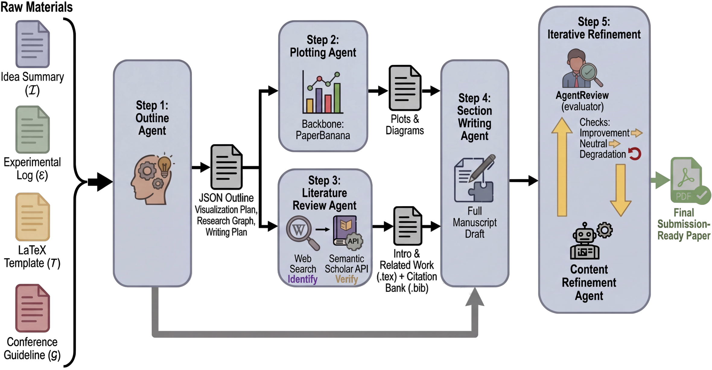

# <div align="center">🎻 PaperOrchestra: A Multi-Agent Framework for Automated AI Research Paper Writing</div>
<div align="center">Yiwen Song<sup>1</sup>, Yale Song<sup>1</sup>, Tomas Pfister<sup>1</sup>, and Jinsung Yoon<sup>1</sup></div>
<div align="center"><sup>1</sup>Google Cloud AI Research</div>
<br><br>

PaperOrchestra is a multi-agent framework for automated AI research paper writing. It flexibly transforms unconstrained pre-writing materials (ideas and experimental logs) into submission-ready LaTeX manuscripts, including comprehensive literature synthesis and generated visuals, such as plots and conceptual diagrams.

Acting like an orchestrated team of specialized agents, it handles outline generation, literature review, section writing, content refinement, and plotting to close the gap between raw research materials and submission ready papers.

<div align="center">
  
</div>

## Key Features

- **Multi-Agent Pipeline**: Orchestrates specialized agents (Outline, Literature Review, Section Writing, Content Refinement, Plotting) for end-to-end paper generation.
- **Comprehensive Literature Synthesis**: Automatically searches, prioritizes, and integrates relevant literature into the manuscript.
- **Visuals Generation**: Generates plots and supports the inclusion of conceptual diagrams.
- **LaTeX Automation**: Produces submission-ready LaTeX manuscripts adhering to target conference templates.

## Installation

1.  **Environment Setup**: The project relies on a Conda environment named `paper_orchestra`. You can set up a similar environment with Python 3.11 and install the required dependencies.
    ```bash
    conda create -n paper_orchestra python=3.11
    conda activate paper_orchestra
    pip install -r requirements.txt
    ```

2.  **Environment Variables**: Create a `.env` file in the root of the project and add your API keys:
    ```env
    # Add keys if you have them, otherwise leave them empty
    # You need to specify related keys if you want to use the model
    # For example, if you want to use Gemini models, you need to specify either VERTEX_AI_PROJECT and VERTEX_AI_LOCATION, or GEMINI_API_KEY
    # If you want to use OpenAI models, you need to specify OPENAI_API_KEY
    
    SEMANTIC_SCHOLAR_API_KEY=your_semantic_scholar_api_key
    OPENAI_API_KEY=your_openai_api_key
    VERTEX_AI_PROJECT=your_vertex_ai_project
    VERTEX_AI_LOCATION=your_vertex_ai_location
    GEMINI_API_KEY=your_gemini_api_key

    # if you want to run demo and send emails to yourself at the end, set these 2 fields as well
    SMTP_EMAIL=your_email
    SMTP_PASSWORD=your_password
    ```

## Dataset

The dataset used for paper generation is **not included** in this code repository. It will be released separately at a later date.
Once available, you should download the dataset and place it under the `datasets/` directory.

## Usage

You can run the paper generation pipeline using the provided bash script or directly via the Python CLI.

### Using the Bash Script
```bash
./paper_writing_cli.sh
```

### Using the Python CLI directly
```bash
python paper_writing_cli.py \
  --raw_materials_dir /path_to_your_raw_materials/ \
  --latex_template_dir /path_to_your_latex_template/ \
  --output_dir /path_to_your_output_folder/ \
  --use_plotting true
```

### Key Arguments
*   `--raw_materials_dir`: (Required) Directory containing the raw materials (e.g., idea and experimental log).
*   `--latex_template_dir`: (Required) Directory containing the LaTeX template (e.g., `templates/cvpr2025`).
*   `--output_dir`: Directory to output the generated paper. If not specified, an automatic folder with a timestamp is created.
*   `--use_plotting`: Enable the plotting agent workflow to generate figures from code (Default: `False`).
*   `--writer_model_name`: LLM for writer and literature agents.
*   `--reflection_model_name`: LLM for reflection agents.

### Interactive Demo

We provide an interactive Streamlit demo for the paper generation pipeline. For instructions on how to run and use it, please refer to the [README.md](frontend/README.md) in the `frontend` directory.

## Project Structure

*   `autoraters/`: Contains scripts for automated evaluation.
*   `methods/`: Core logic for agents and pipeline execution.
*   `templates/`: LaTeX templates for target conferences, you can add your own template by creating a new subfolder under this directory.
*   `utils/`: Utility functions for API calls, PDF handling, etc.

## Citation

If you find this repo or our paper helpful, please cite it as follows:

```bibtex
@article{song2026paperorchestra,
  title={PaperOrchestra: A Multi-Agent Framework for Automated AI Research Paper Writing},
  author={Song, Yiwen and Song, Yale and Pfister, Tomas and Yoon, Jinsung},
  journal={arXiv preprint arXiv:2604.05018},
  year={2026}
}
```

# Disclaimer

This is not an officially supported Google product.
